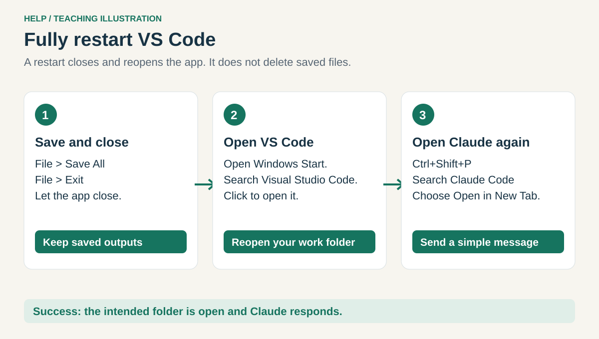
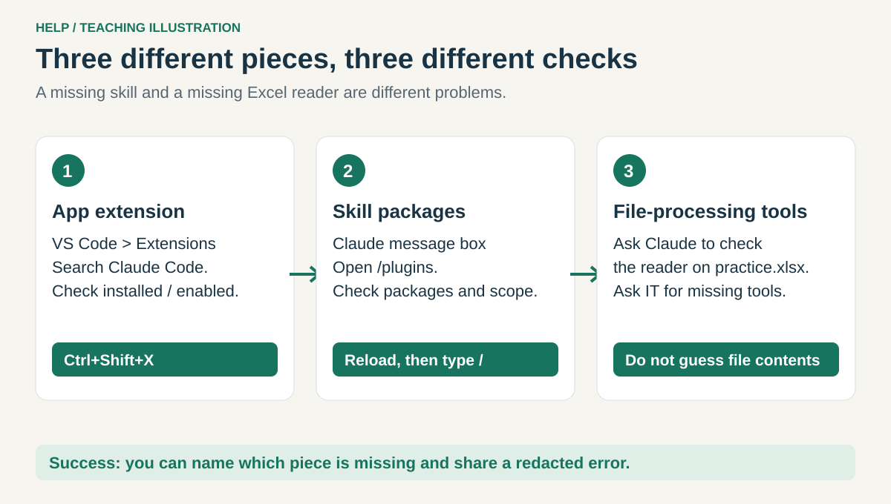
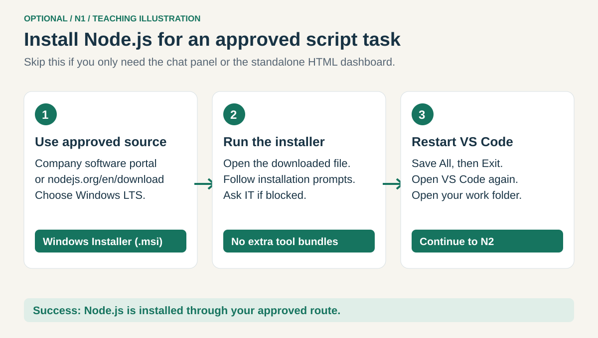
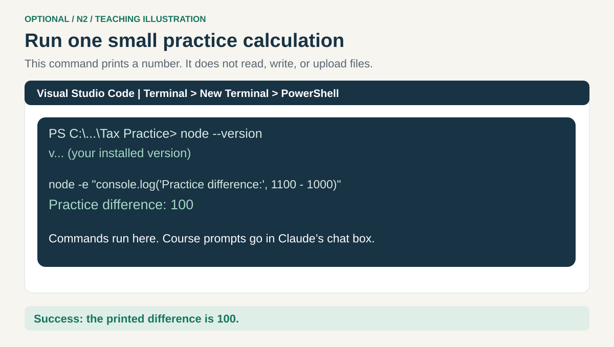

# Help when something is unfamiliar

[Back to the course](README.md)

## Reload Claude Code


**Reload** refreshes the VS Code window and its extensions:

1. Choose **File → Save All**.
2. Hold **Ctrl+Shift+P**. A search box opens at the top: the **Command Palette**.
3. Type **Developer: Reload Window** and click the matching command.
4. Wait for the window to return. Press **Ctrl+Shift+P**, search **Claude Code**, and choose **Open in New Tab**.

**Check:** a fresh Claude conversation opens in your work folder. If work was interrupted, inspect
existing outputs before rerunning a prompt. You can reopen old chats from Claude's session history.


*© Microsoft, [CC BY 3.0 US](assets/reference/ATTRIBUTION.md). Type the reload command instead of the example file command.*

## Fully restart VS Code



If reloading did not help, choose **File → Save All**, then **File → Exit**. This closes VS Code;
it does not delete your files. Open Windows **Start**, type **Visual Studio Code**, and open it.
If your files are missing from the left panel, use **File → Open Folder** to select your work folder.
Open Claude with **Ctrl+Shift+P → Claude Code → Open in New Tab**.

**Check:** VS Code opens your folder and Claude responds to a simple message.

## Plugins or skills are missing



| Problem | Try this |
| --- | --- |
| No Claude panel | Ctrl+Shift+X; check that Anthropic's Claude Code is installed and enabled; reload |
| `/plugins` not offered | Ask IT whether your approved extension version supports plugins and whether policy permits them |
| Package source will not load | Check the exact GitHub source from lesson 2; report the error to IT if network or policy blocks it |
| Installed skill not listed | Check plugin enabled state and scope; reload and open a fresh conversation |
| Reader/library missing | Ask Claude for the dependency name, reason, and minimal acceptance check; use IT's approved route |
| Wrong response or wrong files | Confirm File → Open Folder points to the intended folder; give the exact filename |
| Gateway, sign-in, or model error | Keep current managed settings; send a redacted error to the workplace support team |
| Task seems stuck | Let an active tool finish, or use its stop control; inspect partial outputs before retrying |

**Check:** distinguish the app extension, the skill package, and the file-processing tool.
Installing one does not prove all three work. Do not delete `.claude` to troubleshoot.

## Optional Node.js for work scripts

**Skip this unless an approved task needs a Node.js script.** Node.js runs JavaScript files on your
computer. It does not replace Excel and is not needed for the extension chat or a standalone HTML report.

### N1. Install Node.js only when needed



Use your company's software portal or [the official Node.js download page](https://nodejs.org/en/download).
Select the approved **LTS** release for Windows and the **Windows Installer (.msi)** matching your computer.
Open the downloaded installer and follow the prompts. Leave optional tool bundles unselected unless
IT requires them. Do not run downloaded shell snippets to get through this lesson.
Fully restart VS Code afterward using the steps above.

**Check:** the installation finishes without a policy error. If blocked, ask IT.

### N2. Run one harmless command



In VS Code, choose **Terminal → New Terminal**. The bottom panel accepts commands, not chat prompts.
Select **PowerShell** from its profile dropdown if another shell opens. Run this and press **Enter**:

```powershell
node --version
```

**Check:** a version starting with `v` appears. “Not recognized” means restart or installation/PATH
help is needed; it is not a reason to change execution policy. Now run:

```powershell
node -e "console.log('Practice difference:', 1100 - 1000)"
```

**Check:** `Practice difference: 100` appears. This command calculates and prints; it does not read or write files.
For a real script, return to **Claude's message box** and ask:

```text
Before we run this Node.js script, explain which files it reads, which it
writes, whether it uses the network, and how I can verify the result.
Use only the approved work folder and preserve originals.
```

The `-e` example runs a tiny instruction directly. A saved script instead runs as `node filename.js`
from its folder, after review. Claude can help write it; you do not need to learn JavaScript before
completing the spreadsheet lessons.
