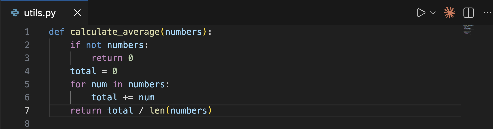
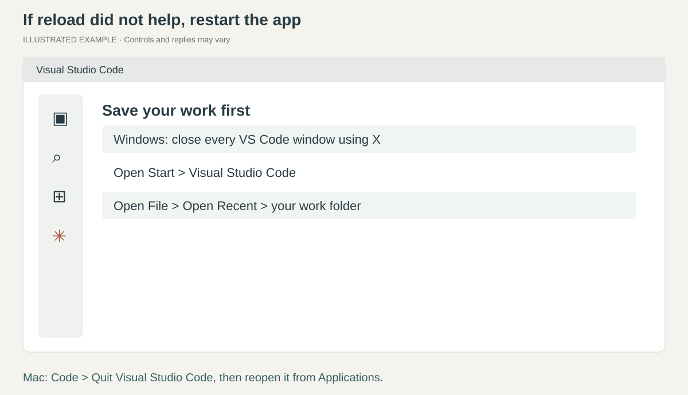
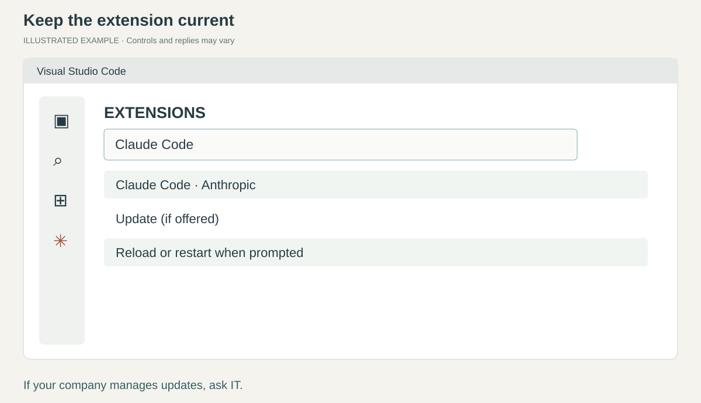
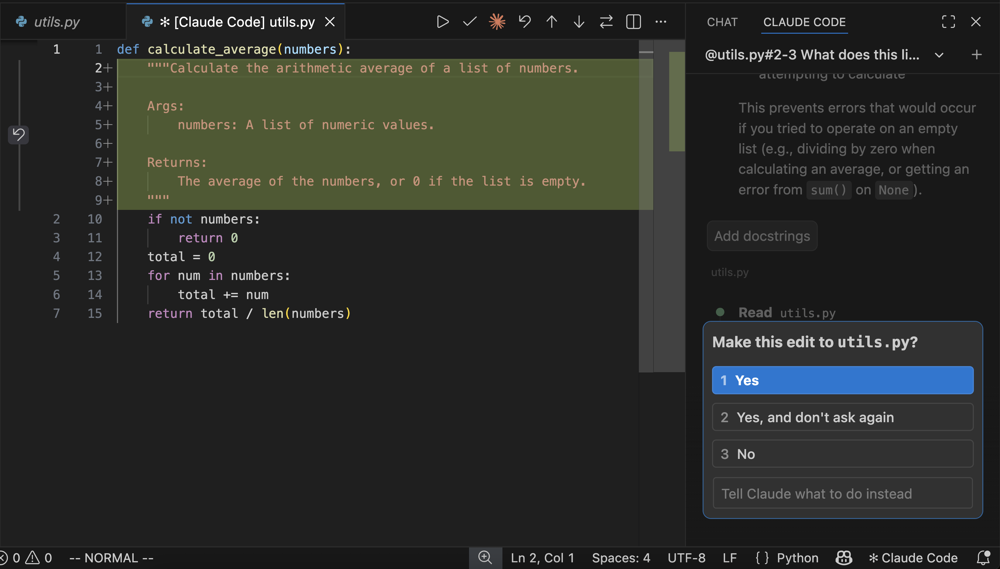

# When you get stuck

[Home](README.md)

## Open Claude's message box

*Reference screenshot from [Anthropic](https://code.claude.com/docs/en/vs-code).*

Press **Ctrl+Shift+P** (Mac: **Cmd+Shift+P**), type **Claude Code**,
and select **Claude Code: Open in New Tab**. Click inside its message box before typing.
If a file is open, the spark icon near the editor's upper-right corner is another way to open Claude.

## Reload the window

Reloading refreshes VS Code and the extension without uninstalling anything.

1. Save any text document you edited with **Ctrl+S** (Mac: **Cmd+S**).
2. Press **Ctrl+Shift+P** (Mac: **Cmd+Shift+P**).
3. Type **Developer: Reload Window**.
4. Click that result, or press **Enter** when it is selected.
5. Wait for the window to return. Open Claude again if needed.

**Check:** Claude's message box appears. Use Session history to resume your conversation.

## Restart the whole app

If reload did not help, save your work.
On Windows, close **all VS Code windows** using their **X** buttons, then open Visual Studio Code
from **Start**. On Mac, choose **Code > Quit Visual Studio Code**, then reopen it from Applications.
Choose **File > Open Recent** and your work folder. Open Claude again.

**Check:** your files are still there and Claude answers a short message.

## Update the extension

Open **Extensions** with **Ctrl+Shift+X** (Mac: **Cmd+Shift+X**).
Find **Claude Code** by Anthropic. Click **Update** if offered, then the reload/restart button.
If no update is offered, the installed version may already be current or company-managed.

To update the work skills, click Claude's **/** menu button, then **Customize > Plugins**.
In **Marketplaces**, refresh the relevant source. Return to **Plugins** and apply any offered update.
Follow the restart banner. If the installed version stays unchanged, ask IT to help update it;
do not remove your personal adaptations.

## Understand a permission request

*Real interface reference from [Anthropic](https://code.claude.com/docs/en/vs-code).
This example edits code; your request may create a workbook or run a spreadsheet tool.*

Read what Claude wants to do and which files it affects. If it is unclear, ask:
**“Explain what this will change before I approve.”**
Approve only the action you understand and intend. You can reject a change and explain what you want instead.
Available buttons and the amount of prompting depend on your permission mode and company settings.

## Something else is confusing

| What happened | What to do |
| --- | --- |
| Claude asks to run code | Ask, “What will this do to my files?” Claude may need code to process Excel. You do not need to write it. |
| It asks for a tool or software install | Ask for a short IT request naming the missing tool and the task it enables. |
| The reply is too technical | Say, “Explain the next step without programming terms. Tell me exactly where to click.” |
| It only tells you how to do the work | Say, “Please do it and save the finished file. Tell me if a tool is missing.” |
| It chooses no useful skill | Check the plugins are installed and enabled, reload, then ask Claude to use relevant installed skills. |
| A spreadsheet won't display in VS Code | Open the file in Microsoft Excel through File Explorer or Finder. |
| Claude cannot see the spreadsheet | Check the open folder. Name the exact file, or hold Shift and drag it into Claude's message box. |
| Sign-in, connection, or company policy error | Keep the error text and ask IT. Use the company-approved connection. |
| A number is wrong | Tell Claude the expected number and its source. Ask it to investigate and recheck the saved output. |

You can always say: **“I'm stuck. Ask me one question to work out where I am.”**
