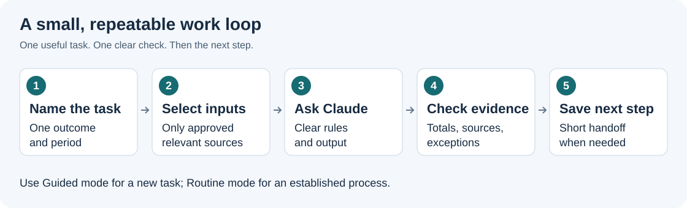

# Learn Claude Code for your work

Start with **one useful task you need to do today**. Keep this page in your browser, open the
approved work folder in the VS Code extension, and choose a task below. You do not need to ask
Claude to read the repository or complete every lesson first.

If VS Code or Claude is new to you, complete [the README first session](README.md) first. It installs
the custom plugin and Office skills, then teaches files and `@` through one Excel task. Then use one installed skill
when the task needs it. Keep the approved model and gateway unchanged. The [VS Code fundamentals](guides/00-vscode-basics.md)
and [saved-request guide](guides/14-prompt-files-and-dictation.md) help with a specific operation.

**Continue in order: [the state workflow course](learn/STATE-WORKFLOW.md).** It builds from the
supplied workbook through reconciliation, an exception note, a cited rule memo, a report, and a
reusable request. The references below are available when you need a specific operation.

## Build on what you just practiced

| You can already do this from the README | Use it for the next task |
| --- | --- |
| Open the right folder and find a file | Keep one work objective and its evidence in the intended workspace |
| Write, dictate, save, and preview Markdown | Collect the task in `prompts/current-task.md` |
| Select a root or nested file with `@` | Give Claude the saved request and specifically approved inputs |
| Change an input and verify a new result | Detect stale values and preserve earlier work |
| Find the six installed slash commands | Use the one procedure the task needs, with no new installation |

For longer tasks, save the request in a local Markdown file, select it with `@`, and say what Claude
should do. A normal request can execute the bounded work; `/property-tax-workbench:prompt-coach` only drafts text.

## Choose today's small result

| What you need today | Finish this much first | Learn and check |
| --- | --- | --- |
| Understand a confusing workbook | A read-only map of one relevant sheet and one formula | [Workbook lesson](learn/02-spreadsheet-work.md#apply-it-to-todays-work): trace a formula to its inputs |
| Investigate a reconciliation difference | One exception note with source references | [Workbook lesson](learn/02-spreadsheet-work.md#apply-it-to-todays-work): check the key, sign, and evidence gap |
| Research a state/local rule | One provision with its applicability and unresolved questions | [Research lesson](learn/03-source-backed-research.md#apply-it-to-todays-work): inspect the citation yourself |
| Explain checked findings | A short reviewer-ready draft | [Reporting lesson](learn/04-reports.md#apply-it-to-todays-work): trace each claim to evidence |
| Repeat a task you already understand | A reusable local request and check | [Adaptation lesson](learn/05-adapt-to-your-work.md#apply-it-to-todays-work): recognize when the method no longer applies |

Use an approved work copy only where that data and its processing are permitted. Keep all actual
inputs, completed task notes, and outputs outside this public repository. If access or tools are
missing, use the lesson's invented example to learn the same operation and record the work blocker.
A small teaching example never proves the complete work population was reconciled.

## Show one step, do the task, check it, reuse it

1. **See one example if needed.** Use the relevant lesson's worked example or ask Claude for one
   small demonstration. Focus on the action, its purpose, and its check. Skip familiar explanations.
2. **Do useful work.** Send the task prompt below with the exact approved input and output. Claude
   completes the authorized bounded work; you select inputs, review proposed actions, and inspect results.
3. **Check one thing yourself.** Trace a formula, open a citation, or compare a memo figure with its
   source. If it fails, describe the mismatch and correct that part. Keep all required work controls.
4. **Reuse with less help.** On the next similar task, try writing the request and naming the check
   before reopening the example. Then compare and correct. Keep a short reusable note locally.

No extra quiz conversation is required. Do the check in Excel or the source document while Claude
is idle. If you need feedback, combine your observation and next request in one message. A learning
pause never requires another approval for unchanged, already authorized work.

## Copy this into Claude for today's task

Replace the bracketed fields. No additional skill installation is needed for this coaching style.
The work itself still needs the appropriate approved tools and sources.

```text
Guided mode. Help me finish [ONE SMALL WORK RESULT] and learn the Claude Code operation needed.
Use only [APPROVED INPUT REFERENCES] for [PERIOD / JURISDICTION]. Follow [KNOWN RULES].
Put the result in [CHAT / APPROVED NEW OUTPUT]. Preserve originals and show [REQUIRED CHECKS].
I already know [RELEVANT KNOWLEDGE / NEW TO THIS OPERATION].
Focus on using Claude Code; do not reteach the accounting I already understand.
Use a practical coworker style: complete the authorized step, explain one unfamiliar operation
briefly, and give me one specific check I can do myself. Use a tiny worked example only if needed.
Ask only for missing facts that change the work. Do not withhold the useful result for a quiz. Do not read the whole repository, install tools, or start other agents.
Prefer the VS Code extension. End with the result, evidence, one check, and a reusable prompt line.
```

**Example of a complete request:**

```text
Guided mode. Draft one exception note in chat from these invented facts: book $200, bill $210,
same stated property and tax year. Cause is unknown. Preserve the supplied facts. Explain the
Bill minus Book calculation briefly and give me one source check. Do not decide a posting or
payment. End with one reusable request line for a future difference.
```

**Expected useful result:** a draft identifying a +$10 difference, an unresolved cause, and a next
source check. **Your check:** calculate 210 - 200 yourself. Before adapting to work, confirm actual
identifiers, period, and source evidence; these invented facts establish no real match or tax treatment.



*Original teaching diagram. Each lesson follows the same loop; the check is part of the task.*

## Reference lessons when you need them

| Lesson | You will learn | You are ready to move on when... |
| --- | --- | --- |
| [1. Your first conversation](learn/01-first-conversation.md) | Where to type, how to ask, when to clarify, and what approval means | You can get a useful explanation and improve an unclear answer |
| [2. Understand and check a spreadsheet](learn/02-spreadsheet-work.md) | Read-only inspection, formulas, comparisons, and exceptions | You can explain a difference and verify its source totals |
| [3. Research a specific rule](learn/03-source-backed-research.md) | Scope, citations, historical applicability, and unknowns | You can tell an inspected source from an unsupported claim |
| [4. Turn checked findings into a report](learn/04-reports.md) | A concise memo, useful chart brief, and reviewer handoff | Every figure and conclusion can be traced to supplied evidence |
| [5. Make the template your own](learn/05-adapt-to-your-work.md) | Global versus project instructions, reusable prompts, and gradual improvement | You can adapt one task without copying private material into this repo |

The lesson numbers are a suggested introduction, not prerequisites for every work task.
Do not install every recommended skill before learning. Lesson 1 and the text exercises work with
the existing Claude conversation. Later steps say when a particular skill, file reader, browsing,
or Office tool is required. If it is unavailable, finish the supported part and mark the gap.

## Six words that make the interface less mysterious

| Term | Plain meaning |
| --- | --- |
| Prompt | The request you send Claude, including the result and checks you want |
| Context | The messages, instructions, and source material Claude can use in this conversation |
| Skill | A reusable set of instructions for a particular task; tools may still be required |
| Model | The AI selected by the approved setup; available choices vary |
| Token | A unit used to process text and other content; more context and output can use more allowance |
| CLAUDE.md | A Markdown instruction file that Claude Code reads in its documented scope |

Markdown is plain text with headings, lists, and code blocks. You can edit it in VS Code. A prompt
in a `text` box belongs in the **Claude chat input**. Shell commands belong in a terminal only when
a guide explicitly says so. Reading a command is not a reason to execute it.

## Let the help shrink as you improve

Use **Teach** when you need a demonstration, **Guided** while doing unfamiliar work, and **Routine**
when you can state the inputs, request, and check yourself. These are this kit's explanation
preferences, not built-in permission modes or professional certification.

On the next similar task, and again after a gap, try the request and check from memory before
consulting your saved prompt. Use a changed case too: a blank amount, a different tax year, or a
missing source. If you miss a condition, return to guidance for that operation. You can skip the
recall exercise during urgent work; do not skip required accounting or source checks.

Use the blank [task note](templates/WORK-TASK-NOTE.md) locally to keep just the useful method.
Progress means you can produce and verify a new result with less help, not that you have read more
pages. [Why this teaching approach](docs/TEACHING-METHOD.md) is optional background for maintainers.

## Keep these nearby

- [Skill catalog](SKILLS.md): what each skill does, how to install it, and a first example.
- [Daily desk guide](guides/DAILY-USE.md): a quick reference once the lessons are familiar.
- [Prompt library](prompts/PROMPT-LIBRARY.md): task templates to copy and adapt.
- [Learning/reference index](guides/README.md): deeper Excel, research, reporting, and usage guides.

Next: choose today's result above. Use **[Lesson 1](learn/01-first-conversation.md)** if the interface is new.
