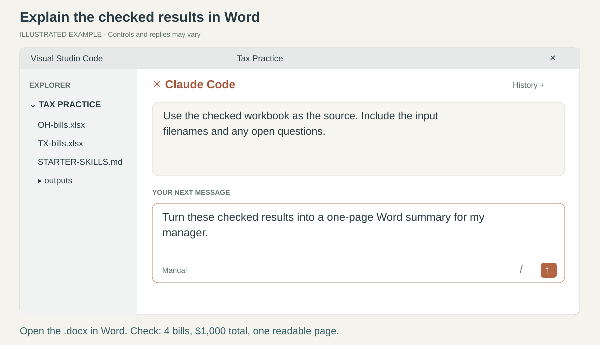
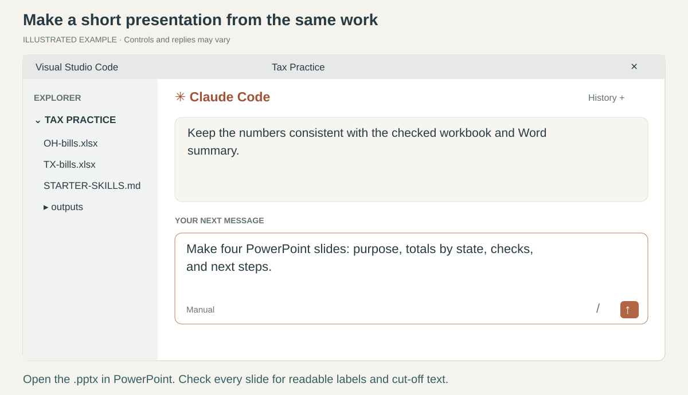
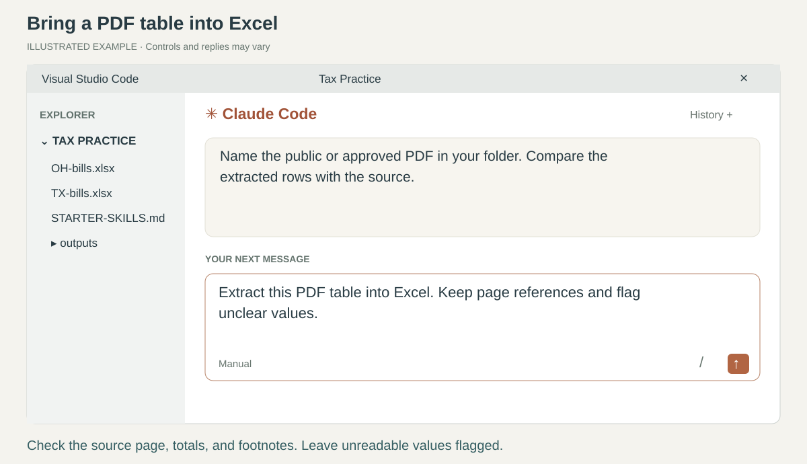
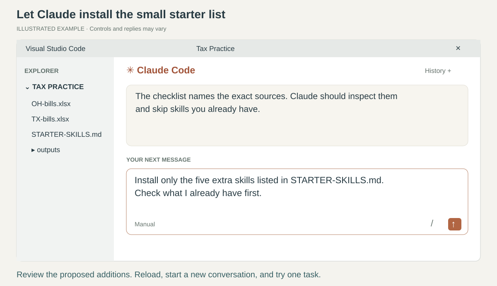
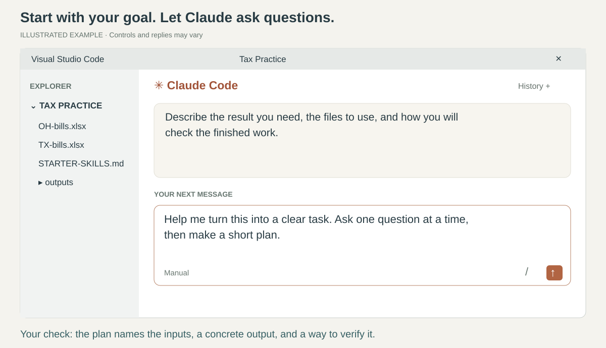
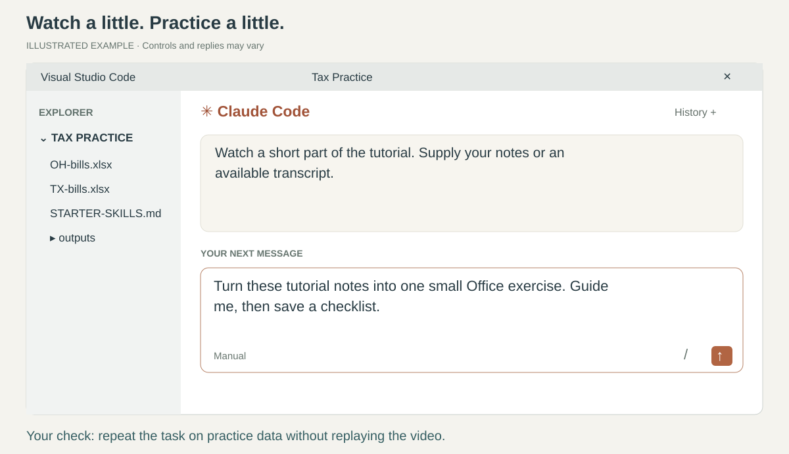
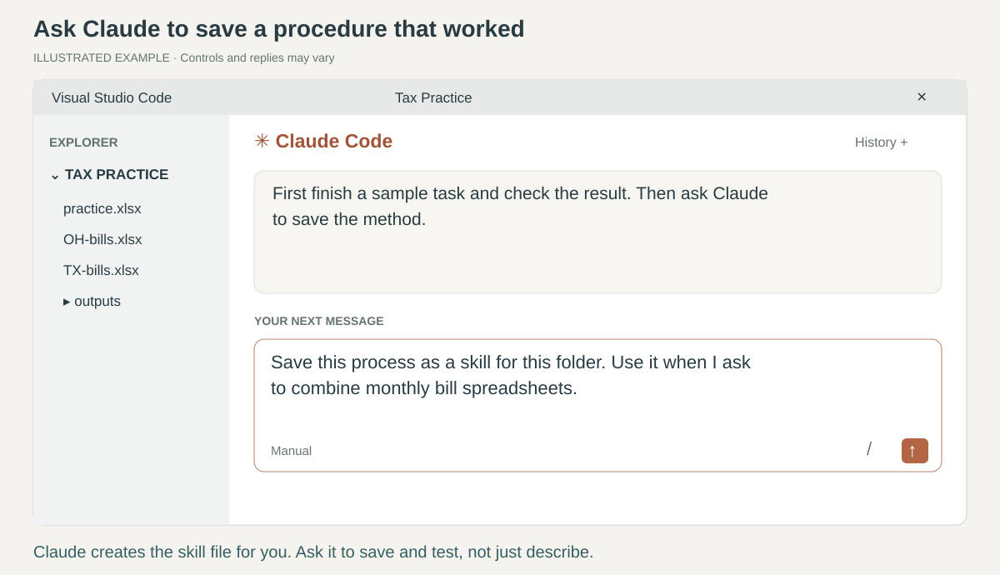
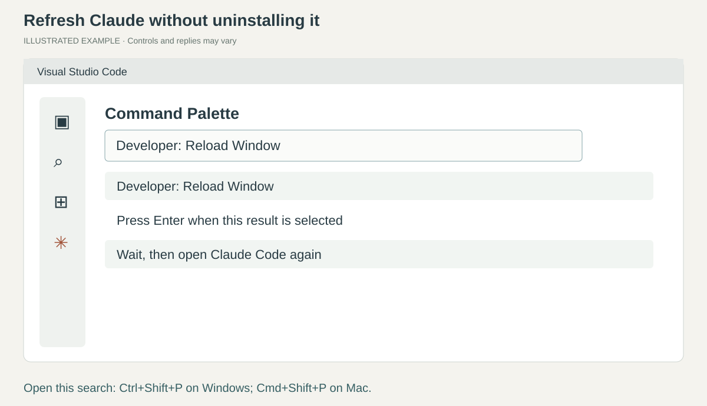

# Your first day with Claude Code and Microsoft Office

**Describe the work. Let Claude help with the steps. Open the result and check it.**

For a property-tax accountant who is new to VS Code and Claude Code. Start with Excel, Word,
PowerPoint, and PDF work. Then add a few helpers for writing, organizing, researching, and learning.

*The illustrated conversations show what to ask and where to type. Real extension reference
screenshots are labeled separately. Your wording and Claude's replies can differ.*

**Use ordinary sentences, typed or dictated.** Claude can choose an installed skill that fits
your request. You do not need to type skill names or commands. A skill is a reusable procedure;
Claude's available tools do the work. [How skills work](https://code.claude.com/docs/en/skills).

## Start here

You can follow the starter walkthrough **on this page**. The longer lessons are optional help.

| Go straight to | What you will do |
| --- | --- |
| [Open Claude and your work folder](#open-claude-and-your-work-folder) | Find the message box and get a reply |
| [Install the Office essentials](#install-the-office-essentials) | Add Excel, Word, PowerPoint, and PDF help |
| [Try Office work](#try-office-work) | Make a workbook, a Word summary, and slides |
| [Five useful extra skills](#five-useful-extra-skills) | Choose a small set of official and community helpers |
| [Install the five extras](#install-the-five-extras) | Let Claude install only the missing selections |
| [Ask better questions and plan work](#ask-better-questions-and-plan-work) | Get guided help on simple or complex tasks |
| [Research and browse](#research-and-browse) | Find sources and save useful findings |
| [Learn with a video](#learn-with-a-video) | Turn a tutorial into one small exercise |
| [Save your preferences and reuse work](#save-your-preferences-and-reuse-work) | Make tomorrow's task easier |
| [Reload or restart](#reload-or-restart) | Recover when something does not appear |

Keep this page open in your browser, with VS Code beside it. Hold shortcut keys together.
**Ctrl+C** copies and **Ctrl+V** pastes. On Mac, use **Cmd** in place of Ctrl.

Use your employer-approved account, connection, files, and storage. Files Claude reads may be sent
to your configured AI provider. The practice spreadsheets contain invented data.

## Open Claude and your work folder

1. Install **[Visual Studio Code](https://code.visualstudio.com/download)** through your company
   software portal or the official download. Open it.
2. Press **Ctrl+Shift+X** (Mac: **Cmd+Shift+X**). Search **Claude Code**, choose **Anthropic** as the
   publisher, and click **Install**.
3. Press **Ctrl+Shift+P** (Mac: **Cmd+Shift+P**). Type **Claude Code** and choose
   **Claude Code: Open in New Tab**. Follow your approved sign-in or company connection instructions.

Click Claude's message box, type the following, and press **Enter**:

> I'm new here. Help me with Microsoft Office, one step at a time.

**Check:** Claude replies. This is where you type every work request. **Shift+Enter** adds a new line.
The separate VS Code Chat button may open a different assistant; look for **Claude Code**.

*Actual interface reference from Anthropic, showing its programming example.
Our Office practice requests go in the same Claude message box. [Image attribution](assets/reference/ATTRIBUTION.md).*

4. [Download the practice kit](https://github.com/jasonjeske/vscode-claude-code/archive/e1aff7e1586856a639c11f8214885e9d8a461708.zip).
   In Windows Downloads, right-click the ZIP, choose **Extract All**, then **Extract**.
   On Mac, double-click the ZIP.
5. Open the extracted folder. Copy **practice** to your approved learning location and rename the
   copy **Tax Practice**. In VS Code choose **File > Open Folder** and open Tax Practice.
   Review the source and company policy before accepting any folder-trust prompt.

**Check:** Explorer lists three spreadsheets, **CLAUDE.md**, **ANSWER-KEY.md**, and **STARTER-SKILLS.md**.
The last file tells Claude which five extra skills to install later.
[More pictures and setup help](lessons/01-setup.md).

## Install the Office essentials

A **plugin** installs a group of skills. Do this once:

1. Click the small **/** menu button beside Claude's message box. Choose **Customize > Plugins**.
2. Open **Marketplaces**, add **jasonjeske/vscode-claude-code**, then return to **Plugins**.
   Install **property-tax-workbench** and choose **Install for you**.
3. In **Marketplaces**, add **anthropics/skills**. In **Plugins**, install **document-skills**
   from **anthropic-agent-skills**, choosing **Install for you**.
4. Follow the restart banner, or [reload the window](#reload-or-restart). Open a fresh conversation.

**The document package already includes these four official skills. You do not need a separate
Excel, Word, or PowerPoint plugin.** Skill labels below help you recognize what is installed;
you do not need to type them.

| Office skill | What it helps create or change | Say something like |
| --- | --- | --- |
| **Excel** (xlsx) | Workbooks, formulas, tables, and charts | “Combine these bill spreadsheets and check the totals.” |
| **Word** (docx) | Reports, letters, procedures, and formatted documents | “Turn these notes into a one-page Word report.” |
| **PowerPoint** (pptx) | Slide decks and presentation edits | “Make four slides explaining these findings.” |
| **PDF** (pdf) | Extracting tables/text, combining documents, and form work | “Extract this PDF table into Excel and flag anything unclear.” |

[Official package contents](https://github.com/anthropics/skills/blob/main/.claude-plugin/marketplace.json).

Claude can create files you open in Office. These skills do not mean it can click every button
inside your desktop apps. Some work requires additional tools; if one is missing, say:

> Tell me what IT needs to provide so you can finish this file.

**Check:** ask, “Which Office skills are available?” Then try an actual small file task below.
A list of skill names is not proof that the required file tools are working.
[Detailed installation help](lessons/02-skills.md).

## Try Office work

### 1. Excel: combine two files and make a dashboard

In the Tax Practice conversation, say:

> Combine OH-bills.xlsx and TX-bills.xlsx into one new Excel workbook.

If Claude asks how to combine them, answer:

> Put the bill rows in one list and keep a column showing the source filename.

Then say:

> Add a Dashboard sheet with the total, bill count, and a chart by state. Save the workbook in outputs.

Claude can create the **outputs** folder for finished files. Open the saved workbook in Excel:
find it in Windows File Explorer or Mac Finder and double-click it.

**Check:** **4 bill rows**, **Ohio $300**, **Texas $700**, **total $1,000**.
The two source Total rows must not become extra bills. Property IDs must keep their leading zeros.
[Full spreadsheet lesson, including reconciliation](lessons/03-excel.md).

### 2. Word: explain the results

Continue in the same conversation:

> Turn these checked results into a one-page Word summary for my manager. Include the source files and anything still needing review.

If Claude asks, use a title such as **Practice bill summary**.
Ask it to save the Word document in outputs. Open the **.docx** file in Microsoft Word.

**Check:** it reports **4 bills totaling $1,000**, identifies the source files, and fits on one readable page.
It must not invent reasons for a difference or claim someone approved the work.

### 3. PowerPoint: present the same work

Say:

> Make a four-slide PowerPoint from this summary: purpose, totals by state, checks, and next steps.

Ask Claude to save the **.pptx** file in outputs. Open it in Microsoft PowerPoint.

**Check:** read every slide. The numbers match Excel; labels are readable; no text or chart is cut off.
If something is crowded, say, “Simplify this slide and make the labels larger.”

### 4. PDF: use a source document

For this exercise, place a small public or employer-approved PDF with a table in your work folder.
Name that file in your request:

> Extract the table from this PDF into a new Excel workbook. Keep the page references and flag unclear values.

**Check:** compare several rows, the total, and any footnotes with the PDF.
A scanned page may need text-recognition software. An unreadable value should stay flagged.

## Five useful extra skills

Start with the Office essentials. Add these **five at most**, skipping any already available.
They were selected from Anthropic's official repository and Composio's established community
collection. [Selection notes and source checks](SOURCES.md#why-these-five-extras).

| Extra skill | Source | What you get | Try it in ordinary words |
| --- | --- | --- | --- |
| **Guided document writing** (doc-coauthoring) | [Anthropic](https://github.com/anthropics/skills/tree/main/skills/doc-coauthoring) | Help defining the reader, outlining, drafting, and checking a procedure or proposal | “Help me write our monthly review procedure. Ask me one question at a time.” |
| **Create and improve skills** (skill-creator) | [Anthropic](https://github.com/anthropics/skills/tree/main/skills/skill-creator) | Turn a useful work process into a reusable skill and test it | “Save this process as a skill. Start with one small practice test.” |
| **Learn Claude** (academy-guide) | [Anthropic](https://github.com/anthropics/skills/tree/main/skills/academy-guide) | Find a relevant official course or tutorial when you ask to learn | “Help me learn to give Claude clearer instructions. Suggest one short tutorial.” |
| **Organize work files** (file-organizer) | [Composio community](https://github.com/ComposioHQ/awesome-claude-skills/tree/master/file-organizer) | Propose a useful folder layout and carry out agreed organization | “Suggest a better layout for this folder of practice copies. Don't move anything yet.” |
| **Research and draft** (content-research-writer) | [Composio community](https://github.com/ComposioHQ/awesome-claude-skills/tree/master/content-research-writer) | Build an outline, find sources, and improve a written explanation | “Help me write a short work explainer with verified primary sources.” |

Guided writing helps decide **what to say**; the Word skill makes the **Word file**.
The research-writing helper supports general writing. For property-tax rules, keep using the
tax research procedure and verify the state, jurisdiction, property type, and tax year.

**Keep it light:** Claude normally sees skill descriptions first and loads full instructions when
it uses a skill. More installed skills do not all run at once, but duplicate helpers and large
active workflows can add context and work. There is no guaranteed “safe number.”
Install only what you will use, try one task at a time, and avoid installing whole collections.
[Anthropic's explanation of skill loading](https://code.claude.com/docs/en/skills).

## Install the five extras

1. Open your **Tax Practice** folder in VS Code.
2. Check that **STARTER-SKILLS.md** appears in Explorer. If you have an older practice folder,
   download the updated kit above and copy only this text file into your existing folder.
3. Tell Claude:

> Install only the five extra skills listed in STARTER-SKILLS.md. Check what I already have first.

Claude should read the checklist, inspect the selected sources, and report what it proposes to add.
Review its explanation and any permission requests. It should copy the complete selected skill
folders, including required support files, without installing either entire collection.
If company policy blocks this, ask Claude for a short IT request.

4. [Reload the window](#reload-or-restart), start a new conversation, and try one request from the table.
5. Ask, “What did you install, what was already available, and what could not be installed?”

**Check:** try a real small task, not just a skill listing. For the file organizer, approve only
a proposed plan for practice copies first. For skill creation, request one sample test before
any larger benchmark or parallel evaluation.

These are **personal skills**, separate from the workbench plugin. They do not update merely
because you update the workbench. Later, say:

> Check for updates to my five starter skills. Explain the changes and back up my copies before updating.

## Ask better questions and plan work

You do not need a special prompt-writing skill to start. Describe the outcome, identify the files,
and say what would make the result useful.

> I need a monthly property-tax workpaper. Help me turn that into a clear task. Ask one question at a time.

Answer normally. For example: “Use these three workbooks. I need an Excel summary for my reviewer.”
Then say:

> Summarize what we agreed, make a short plan, and start with the first step.

For a longer project:

> Keep a short project note with our goal, next steps, decisions, and open questions. Update it as we work.

**Check:** the plan names a concrete output, the right inputs, and a way to verify it.
You can ask, “Which parts are facts, which are assumptions, and what evidence is missing?”
This helps you check the reasoning without needing technical prompting formulas.

## Research and browse

A normal research request is enough when your approved connection provides search tools:

> Find the official business personal property instructions for Travis County, Texas, for 2026. Show me the sources.

Then:

> Save the findings and source links, and add a Research sheet to a copy of my workbook.

**Check:** open a source yourself and verify the year and applicability.
No verified source means the finding remains unresolved. [Full research lesson](lessons/04-research.md).

Searching public information and operating a browser are different capabilities.
If you later need Claude to interact with a website, the official **Claude in Chrome** integration
can connect to the VS Code extension when supported by your account and company policy.
Use [Anthropic's setup instructions](https://code.claude.com/docs/en/chrome).
It is a browser connection, not another research skill. Sign-in and website permissions still apply.
A downloaded skill does not grant general control of every app on your desktop.

## Learn with a video

Open [Claude Academy's Claude Code section](https://academy.claude.com/code) for official learning resources.
For YouTube, Anthropic's [Getting started with Claude.ai](https://www.youtube.com/watch?v=0vZ_UVLhSQQ)
introduces general conversation and prompting. **It shows the Claude website, not VS Code**;
use this guide for extension setup.

1. Watch one small part that is relevant to your work.
2. Pause and try the idea using practice data.
3. Type a few notes, or supply an available transcript, and ask Claude:

> Turn these tutorial notes into one small Office exercise. Guide me through it, then save a short checklist.

**Check:** you can repeat the task without replaying the video.
Claude must not claim to have watched a video when it only saw the title, description, or your notes.
A video transcript is not guaranteed to be available, and you do not need a video-downloader skill to start.

## Save your preferences and reuse work

Open [GLOBAL-CLAUDE.md](GLOBAL-CLAUDE.md), copy its preference box, and paste it beneath this request:

> Add these to my global Claude Code instructions. Keep my existing instructions and save a backup first.

After completing and checking a useful task:

> Save this process as a skill for this folder. Use it when I ask for the monthly bill review.

To improve it later:

> Update my saved procedure to include the source filename. Keep a backup and test the change.

**Check:** start a fresh conversation, describe the task without naming the skill, and check its saved output.
[More help creating, modifying, and reusing skills](lessons/05-repeat.md).

## Reload or restart

Save any text you edited. Press **Ctrl+Shift+P** (Mac: **Cmd+Shift+P**), type
**Developer: Reload Window**, and select it. Wait for VS Code to return, then reopen Claude.

If that does not help, save your work and close every VS Code window. On Windows reopen
Visual Studio Code from Start. On Mac choose **Code > Quit Visual Studio Code**, then reopen it.
Choose **File > Open Recent** and your work folder. [More troubleshooting](HELP.md).

## When you want more detail

[Setup pictures](lessons/01-setup.md) · [Skill installation](lessons/02-skills.md) ·
[Excel and dashboards](lessons/03-excel.md) · [Tax research](lessons/04-research.md) ·
[Create your own skills](lessons/05-repeat.md) · [Practice answer key](practice/ANSWER-KEY.md).

The longer lessons remain available, but you can do the starter exercises from this README.
[Sources, image attribution, and validation limits](SOURCES.md).
