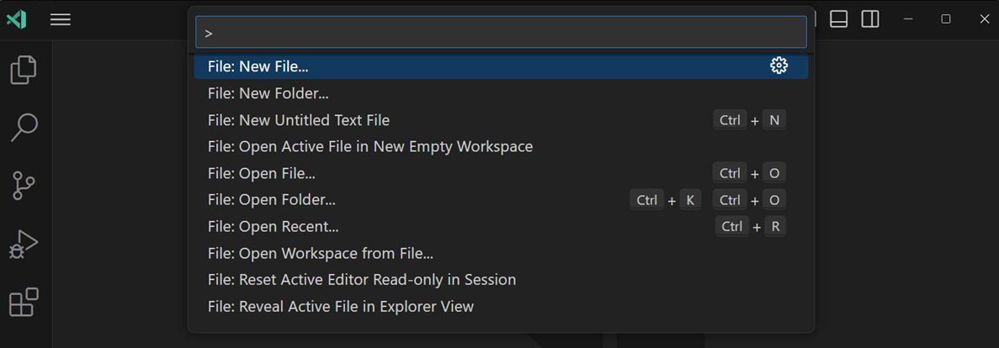
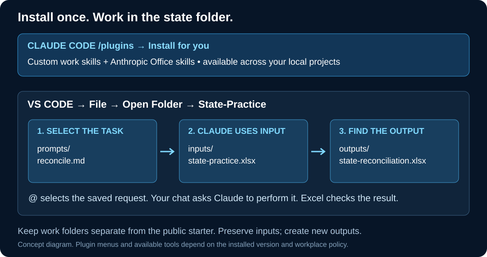
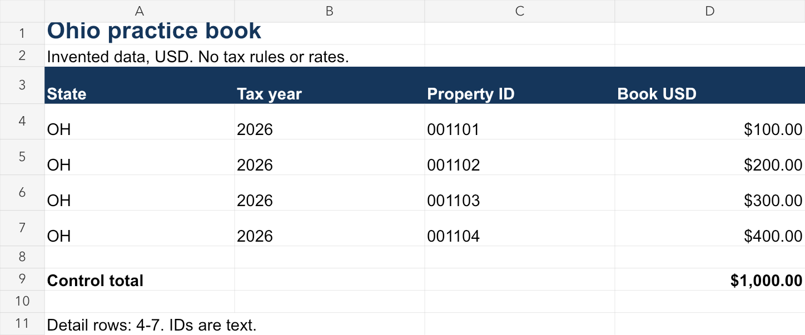

# Use Claude Code in VS Code for property-tax work


**Start with one state, one workbook, and one useful result.** Install the skills through the
Claude Code extension, let Claude prepare a working folder, then inspect a workbook and check its
findings in Excel. Later lessons build toward reconciliation, state-law research, and reporting.

This guide assumes **VS Code and the Claude Code extension already connect through your approved
workplace gateway**. Keep that connection and model. No personal subscription or GitHub login is
required to read or download this public guide. Use invented practice data first; actual work and
its processing need approved storage and tools. Nothing here determines a tax filing position.

**Your first result:** a map of a small Excel workbook, saved beside it, with one finding you can
verify yourself. You will use the supplied invented Ohio 2026 file. Then repeat the method on one
approved workbook for the state you actually handle. No full-drive scan or all-state upload.

## 1. Open the starter in VS Code

**What is `README.md`?** It is this guide saved as a **Markdown** file. The `.md` ending identifies
an ordinary text document that can display headings, bold words, and lists. GitHub shows its
formatted reading view. You will use the same kind of file for saved requests to Claude.

1. [Download the ZIP](https://github.com/jasonjeske/vscode-claude-code/archive/refs/heads/main.zip).
   In your browser's downloads list choose **Show in folder**.
2. Right-click the ZIP > **Extract All**. Choose an approved learning location, then **Extract**.
   Open the extracted folders until you see `README.md`, `state-project`, `skills`, and `setup`
   together. This is the **starter folder**, not the ZIP itself.
3. Open **Visual Studio Code** from Windows Start. Choose **File > Open Folder**, select that
   starter folder, and choose **Select Folder**. Follow workplace Workspace Trust policy.
4. Press **Ctrl+Shift+P**, type **Claude Code**, and choose **Open in New Tab** or the offered
   Claude open-panel command. Click the **Claude Code message box** when sending a request.



*This is the real VS Code Command Palette. Search for **Claude Code** in that box to open the
extension. The screenshot shows example file commands. © Microsoft, [CC BY 3.0 US](assets/reference/ATTRIBUTION.md).*

**Check:** VS Code's Explorer shows `state-project` and `setup`, and the conversation panel says
**Claude Code**. If the gateway is disconnected, use workplace support. **Next: install the kit.**

## 2. Install the skills inside Claude Code

A **plugin** packages skills so Claude Code can install, enable, update, and remove them together.
You do not need to copy six skill folders by hand. This repository now provides that package.

In **Claude Code's message box**, type **`/plugins`** to open **Manage plugins**. These steps use
Claude's plugin panel, not VS Code's Extensions search and not a terminal.

| In the panel | What to enter or choose |
| --- | --- |
| **Marketplaces** > add source | `jasonjeske/vscode-claude-code` |
| **Plugins** > find the kit | `property-tax-workbench` from `property-tax-learning` |
| **Install** > scope | **Install for you**, when permitted by workplace policy |
| Apply changes | Use the offered restart, then open a fresh Claude conversation |

That one installation supplies **all six custom skills**: workbook review, reconciliation review,
property-tax research, financial dashboards, prompt coaching, and structured work requests.
It adds instructions; it does not install Excel libraries, connect databases, or configure agents.

**Personal scope means available across your local projects.** Claude manages the package's cache;
do not move those files into `.claude/skills`. Normal requests can select a matching skill. To
choose one explicitly, type `/` and select, for example,
**`/property-tax-workbench:excel-workbook-review`**. Check the actual menu for your installed version.

If adding the GitHub source fails because Git or network access is unavailable, the custom kit can
also use your **extracted starter's full folder path** as the marketplace source. Copy that path
from Windows File Explorer's address bar into **Marketplaces**. If plugins are restricted, keep the
step pending and use the supported workplace route. [Manual-copy fallback](setup/MANUAL-SETUP.md).

**Already copied standalone skills from an older guide?** Those are a separate installation.
Use one route, not both. Keep the existing copies or follow the
[plugin migration steps](setup/SKILLS.md#switch-from-manual-copies-to-the-plugin) before removing any.

**Check:** the plugin is installed and enabled, and its six namespaced skills appear in `/`.
A skill name appearing proves discovery, not that its Excel tools work. **Next: add Office support.**

## Add Anthropic's Office skills for Excel work

Use the same **Manage plugins** panel:

| In the panel | What to enter or choose |
| --- | --- |
| **Marketplaces** > add source | `anthropics/skills` |
| **Plugins** > find the package | `document-skills` from `anthropic-agent-skills` |
| **Install** > scope | **Install for you**, when permitted |
| Apply changes | Use the offered restart and confirm the XLSX entry in `/` |

This is Anthropic's **Excel (`xlsx`), Word (`docx`), PowerPoint (`pptx`), and PDF** package.
Our custom workbook review skill complements it. You can ask “Use the XLSX skill to create this
workbook,” or explicitly choose the actual entry, such as `/document-skills:xlsx`.

The package has specific license terms and runtime requirements. Python libraries and an Office
calculation tool may be needed; a gateway key does not install them. If a required tool is absent,
Claude must report the blocker. Use workplace support for the approved runtime, rather than
changing the gateway or installing unapproved software.
[Source/runtime details](guides/07-trusted-skills-and-installation.md#findings-that-change-the-recommendation).

**Check:** distinguish **package installed** from **file task completed and checked in Excel**.
The next task will establish which capabilities actually work on this machine.

## 3. Let Claude prepare the practice workspace



*Concept diagram: install the procedures once, then keep each project's files together.*

Keep the **starter folder open in VS Code**. Paste this in Claude Code:

```text
The extracted vscode-claude-code starter is open in VS Code. Read only setup/ASSISTED-SETUP.md
and follow it to create a new state practice workspace beside this starter in approved learning
storage. Use the included state-project as the source. Preserve existing files and settings.
Do not read the rest of the repository, install packages, or begin the workbook task yet.
Show the destination, verify the copied files, and tell me which folder to open next in VS Code.
```

Claude now does the folder preparation. Respond to any actual path or tool-access question;
if it reports the setup file is missing, repeat step 1 and open the extracted starter itself.
This prompt works because the named setup file is present in the currently open folder.

When Claude finishes, choose **File > Open Folder** and select the exact new path it reported,
usually the sibling **State-Practice**. Reopen Claude Code with **Ctrl+Shift+P** if needed.

```text
State-Practice/               open this folder for the exercises
  CLAUDE.md                  supplied practice instructions
  inputs/state-practice.xlsx  invented Ohio workbook, with Book and Bill sheets
  prompts/first-workbook.md   first task, ready to select
  prompts/reconcile.md        later reconciliation task
  outputs/                   where new results go
  evidence/                  checks and source notes
  working/                   intermediate work
```

**Check:** your open project is the new working copy. In **View > Explorer**, expand `inputs` and
`prompts` and confirm those files exist. The original starter remains separate. **Next: useful work.**

## 4. Inspect one workbook and check the result in Excel

### First, read the saved request: what a Markdown file looks like

In **View > Explorer**, expand **prompts** and double-click **first-workbook.md**. This document
contains the task you will give Claude. It is text, not an Excel workbook or a program to run.

Markdown has two appearances: the **source text** you edit and the **formatted view** you read.
They represent the same document:

| Text stored in the file | What the formatted view shows |
| --- | --- |
| `# Review the workbook` | A large heading saying “Review the workbook” |
| `- Preserve the original` | A bullet followed by “Preserve the original” |
| `**Check the total**` | **Check the total** |
| `Use the Book sheet.` | Use the Book sheet. |

**Using an inline Markdown editor?** It can show a formatted page while letting you edit in the
same place. In editors that reveal the active line, clicking a heading may expose its `#`, or
clicking bold words may expose `**`. That is the underlying text, sometimes called **raw Markdown**.
The file has not broken or become code. Keep those marks if you want to keep the formatting.
Moving out of the line may restore its formatted appearance; the exact behavior depends on the
installed extension. There is no need to open two panes or install a second Markdown editor.

**If you see plain text instead:** that works too. You can read and edit it directly. VS Code's
built-in **Ctrl+Shift+V** opens a formatted reading preview; return to the text editor to edit.
[Reading and editing controls](guides/00-vscode-basics.md#4-read-and-edit-markdown-in-one-pane).

Read the supplied request without changing it for this first task. When you later type or dictate
your own requests, save with **Ctrl+S** before sending them. Ordinary sentences are enough; headings
only organize your thoughts. **Opening, formatting, or saving a request does not run it.** Next,
you will select that saved file in Claude chat and explicitly ask Claude to perform the task.

### Give the saved request to Claude

1. In Claude's message box, type **`@prompts/first-workbook.md`** and choose that exact file from
   the suggestions. `@` selects a saved file for Claude to read; it is not a Windows command.
2. Add the following text and send once:

```text
Read the selected first-workbook.md as my task and perform it using the named practice workbook.
Use the installed Excel review skill if available. Give me the actual new output path and one
check to do in Excel. Keep the original workbook unchanged. Explain one unfamiliar VS Code step
briefly, but focus on completing the task. Report a missing reader instead of guessing contents.
```

3. When complete, open **Explorer > outputs > workbook-map.md** (or the new name reported).
   Read its sheet names and the cited source location. A chat reply alone is not the saved result.
4. In Explorer, right-click **inputs > state-practice.xlsx** > **Reveal in File Explorer**.
   Double-click the file there to open it in **Microsoft Excel**. Select the **Book** tab and
   check one cited row and the total. Close the original without saving changes.



*Preview rendered from the supplied practice workbook, not a screenshot of your Excel installation.
All records are invented. The Book and Bill sheets deliberately contain different populations.*

**Check:** there are four detail rows in each sheet. Book total is **$1,000** and Bill total is
**$1,100**. Property IDs keep their leading zeros. If a tool could not read the file, do not accept
invented sheet descriptions. You can inspect the file yourself in Excel while getting the approved
reader installed. [A text-only fallback](learn/02-spreadsheet-work.md#learn-a-formula-on-a-tiny-example)
is available if tools are blocked.

You have now opened a project, selected a saved task, used Claude on an Excel file, found its
output, and checked source evidence. **Next: reconcile the two sheets in session 2 below.**

## 5. Continue from beginner toward intermediate

Keep using one state and one reporting period. Each session produces a useful workpaper and adds
one editor/Claude skill. Stop after the checked output; no need to complete a whole course in a day.

| Session | Work result | VS Code / Claude operation learned |
| --- | --- | --- |
| **1. Inspect** | Workbook map checked against the actual file | Open folder, select `@file`, find output, open in Excel |
| **[2. Reconcile](learn/STATE-WORKFLOW.md#2-reconcile-the-state-workbook)** | Matched comparison, both unmatched sides, controls | Run a saved task; let XLSX tools create a new workbook; check totals |
| **[3. Investigate](learn/STATE-WORKFLOW.md#3-investigate-one-difference)** | One evidence-backed exception note | Narrow an input range; revise a saved prompt; separate facts from causes |
| **[4. Research](learn/STATE-WORKFLOW.md#4-research-one-state-rule)** | One cited rule memo for the applicable jurisdiction/year | Select source documents or allow a scoped official-source search |
| **[5. Report](learn/STATE-WORKFLOW.md#5-report-checked-results)** | One summary with a useful chart and visible exceptions | Specify the audience, output format, and chart checks |
| **[6. Repeat](learn/STATE-WORKFLOW.md#6-repeat-with-a-new-period-or-state)** | Reusable state project and request | Edit Markdown, reuse instructions, compare periods without stale inputs |

**Bring your work in after the practice check:** choose one approved workbook for a state you
handle. Ask Claude to prepare a separate work folder at an approved path. Supply the actual
period, matching rules, and allowed operations. Start with a read-only map, not a full rewrite of
an inherited workbook. Complex PivotTables, Power Query, macros, and connections need native
Excel preservation checks before changes. [Move to your state project](learn/STATE-WORKFLOW.md#move-to-your-own-state-project).

## Know the controls when you need them


*Use the left file list to find inputs and outputs. Your Claude panel opens through the command
in step 1. The code and terminal pictured are Microsoft's example; this course uses workbook and
request files. © Microsoft, [CC BY 3.0 US](assets/reference/ATTRIBUTION.md).*

| Need | Action |
| --- | --- |
| Find a file yourself | **Ctrl+P**, type its name, choose the correct folder |
| Give a file to Claude | In Claude chat type **@**, choose the saved file, then add the task |
| Choose a particular skill | In Claude chat type **/**, choose its actual namespaced command |
| Write a longer request | Open a `.md` file in the editor, edit or dictate, then **Ctrl+S** before selecting it |
| Read Markdown comfortably | Use the approved inline editor; built-in fallback is **Ctrl+Shift+V** |
| Recover from split editors | **View > Editor Layout > Single** |
| Resume next time | **File > Open Recent** > your state workspace > open Claude |

Ask normally. Installed skills can be selected from a matching request; `/` is the explicit
fallback. A skill supplies a procedure, `@` supplies an input, and your request sets the allowed task.
Use focused conversations, the approved model, and the gateway's usage page. Avoid asking Claude
to read every guide or all the files for every state. A saved prompt is reusable, not token-free.

## Reference shelf

- [State workflow and assignments](learn/STATE-WORKFLOW.md): the remaining sessions and transfer to work.
- [Skill catalog](SKILLS.md): all six custom skills, official Office/Finance/Data choices, and community options.
- [VS Code basics](guides/00-vscode-basics.md) and [saved prompts](guides/14-prompt-files-and-dictation.md).
- [Plugin updates and manual-copy fallback](setup/SKILLS.md).
- [Prompt library](prompts/PROMPT-LIBRARY.md) and [Excel preservation playbook](guides/08-excel-and-reconciliation-playbook.md).
- [Validation and limits](docs/TOOLKIT-VALIDATION.md): local package checks do not establish managed Windows behavior.

Official references: [Claude Code in VS Code](https://code.claude.com/docs/en/vs-code),
[plugin installation](https://code.claude.com/docs/en/discover-plugins),
[skill selection](https://code.claude.com/docs/en/skills).
