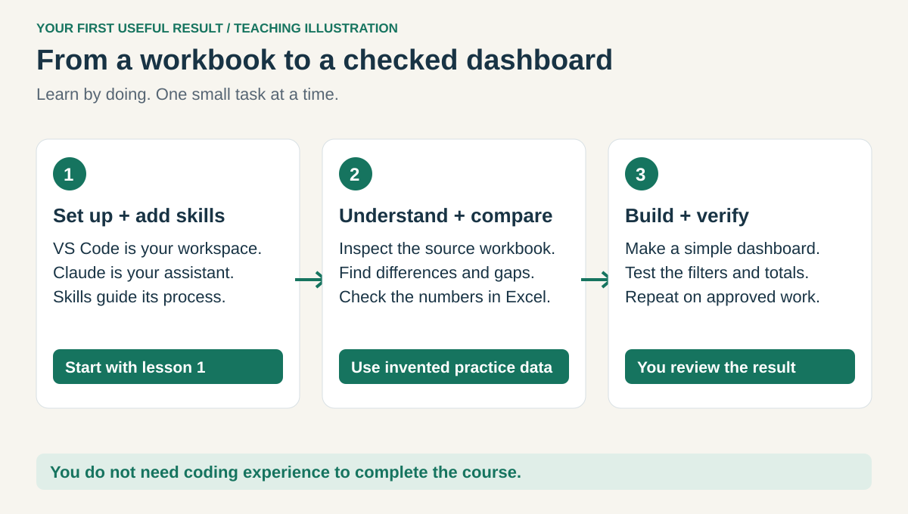

# Claude Code + Excel: your first property-tax workflow

**A beginner's course for a U.S. property-tax accountant using Claude Code in VS Code.**
No coding or VS Code experience needed. Follow the pictures, paste one prompt, and check one result.

You will compare a book balance with a tax bill, find differences that cancel each other out,
and turn the checked results into a dashboard. Start with our tiny, invented workbook.
The method can be reused across U.S. states; tax rules and deadlines must be checked separately
for the state, local jurisdiction, tax year, and property type.

| Read in this order | What you will do |
| --- | --- |
| **[1. Set up](lessons/01-setup.md)** | Install VS Code and Claude Code; open your practice folder |
| **[2. Add skills](lessons/02-skills.md)** | Install two skill packages; copy your global instructions |
| **[3. Analyze Excel](lessons/03-excel.md)** | Inspect, reconcile, and verify the practice workbook |
| **[4. Make a dashboard](lessons/04-dashboard.md)** | Create a local report; check its numbers; repeat on approved work |

**Keep this guide open in your browser and VS Code beside it.** Instructions use Windows.
`Ctrl+C` copies, `Ctrl+V` pastes, and `Ctrl+S` saves. Hold the keys together.
Each numbered step has an illustration, a small action, and a success check.

**Need help?** [Reload or restart Claude Code](HELP.md#reload-claude-code) ·
[Optional Node.js lesson](HELP.md#optional-nodejs-for-work-scripts) ·
[Copy global instructions](GLOBAL-CLAUDE.md) · [Practice answer key](practice/ANSWER-KEY.md)

## Four words you need

| Word | Plain meaning |
| --- | --- |
| VS Code | The app that holds your work folder and Claude panel |
| Claude Code | The assistant inside VS Code that can read files and run approved tools |
| Skill | A reusable set of instructions for a kind of task |
| Plugin | A package that installs skills together |

**For work:** use your employer-approved account, connection, files, and storage. A file stored on
your computer can still be sent to the configured AI provider when Claude reads it. Keep the
public guide free of actual work data. Your review is part of every result.

About the pictures and this repository

The numbered images are original teaching illustrations, not screenshots or proof of a Windows
installation. Button placement may vary. Two real Microsoft reference screenshots are credited
[in their attribution file](assets/reference/ATTRIBUTION.md).

The course replaces the older overlapping guides and six-skill kit. The new kit retains workbook
analysis and dashboards. Earlier material remains in Git history. Existing users can update the
installed `property-tax-workbench` through `/plugins`; locally copied skills are separate and
should be reviewed before removing any personal adaptations.

Setup references were checked September 5, 2026. [Sources and checks](SOURCES.md).
The `skills`, `.claude-plugin`, and `tests` folders support the course; learners do not edit them.

