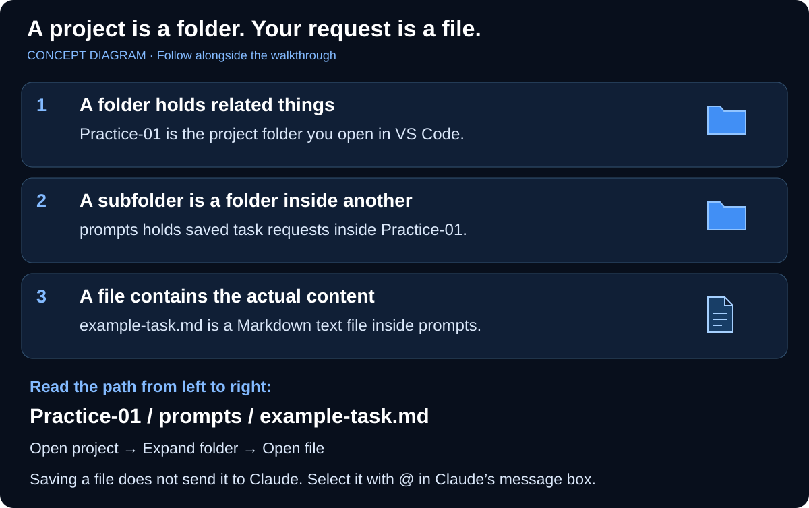
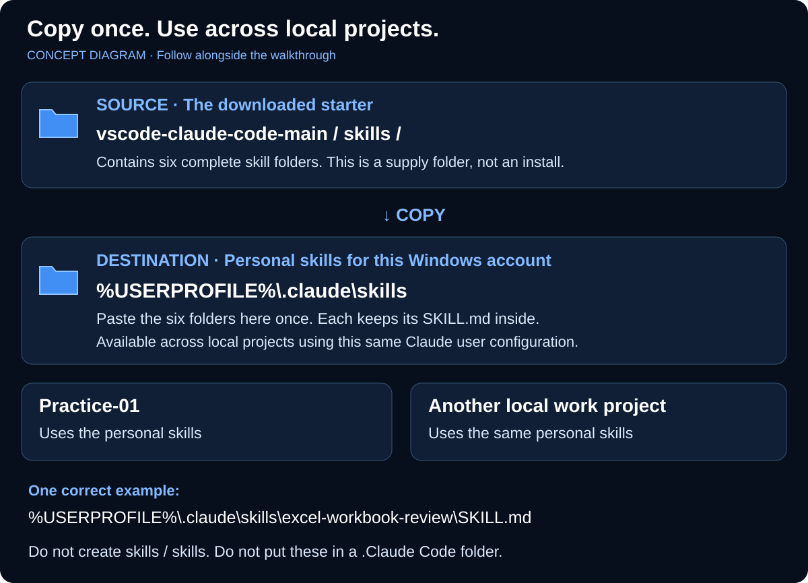
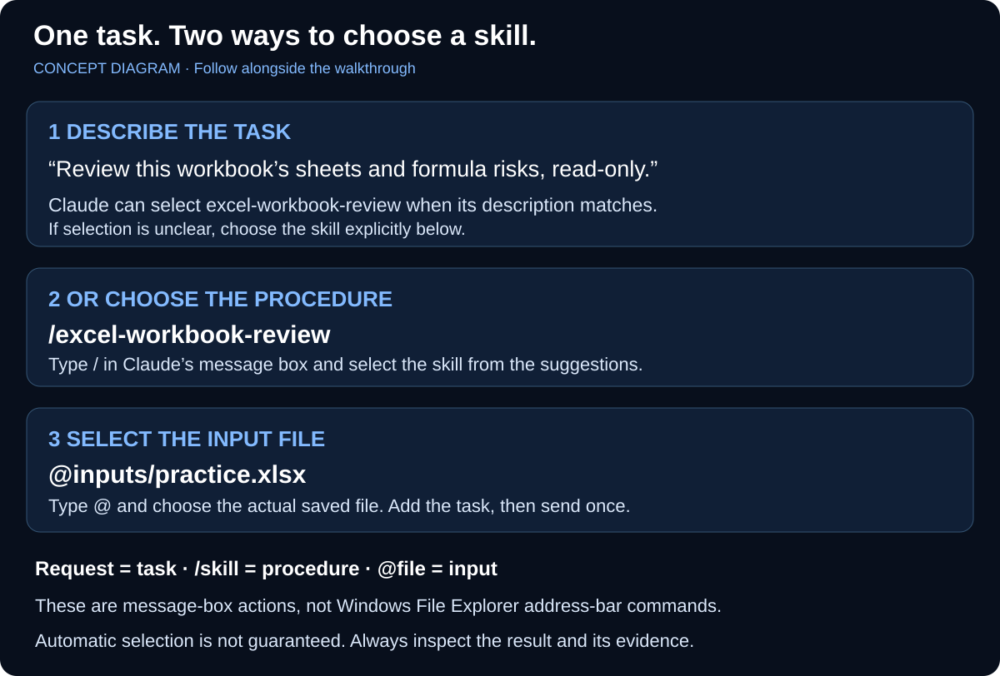

# Skills made visible: install, select, use

[Back to the README walkthrough](../README.md) | [Skill catalog](../SKILLS.md)

**Outcome:** find one installed skill, use it for one matching task, and explain how its folder
is different from the project and input file. Follow this alongside a useful task; it is not a
separate course to finish before working.

## 1. Recognize the folder and the file



*Concept diagram, not a screenshot of Windows or VS Code.*

**Try it in VS Code:** open your `Practice-01` folder, choose **View > Explorer**, expand `prompts`,
and double-click `example-task.md`. You are opening the file to read it; you have not sent it to
Claude. Leave the supplied example unchanged.

**Check:** the editor contains request text. The path `prompts/example-task.md` means the file is
inside `prompts`, relative to the project folder. `Ctrl+P` finds it for you; `@` selects it for Claude.

## 2. Recognize the installed skill



**The default walkthrough installs personal skills**, sometimes called global skills. The exact
folder is `%USERPROFILE%\.claude\skills`, not `.Claude Code/skills`. `%USERPROFILE%` is a Windows
shortcut to your user folder. The dot in `.claude` is part of its name.

**Try it in Windows File Explorer:** press **Windows+E**, click the address bar, type
`%USERPROFILE%\.claude\skills`, and press **Enter**. Open `excel-workbook-review`; it should contain
`SKILL.md`. Research also has a `references` subfolder. If the path is missing, return to
[README step 4](../README.md#4-install-all-six-included-skills-in-one-copy-operation).

| What it is | Example | What it does |
| --- | --- | --- |
| Downloaded supply folder | `vscode-claude-code-main/skills` | Stores the six folders to copy; downloading alone does not install them |
| Personal skill | `%USERPROFILE%\.claude\skills\excel-workbook-review\SKILL.md` | Available across local projects for this account's Claude configuration |
| Project skill, an alternative | `Practice-01/.claude/skills/excel-workbook-review/SKILL.md` | Available in this project; not the walkthrough's default |
| Project instructions | `Practice-01/CLAUDE.md` | Explain the current project's rules; not a skill installation |
| Saved request | `Practice-01/prompts/example-task.md` | Holds a particular task; select it with `@` when needed |

**Check:** `SKILL.md` is inside a named skill folder, not loose under `skills`. The same personal
copy can be used after opening another local project. You do not reinstall it per workbook.
This does not sync it to other PCs, Claude web, or Cowork. A managed custom configuration directory,
remote VS Code session, WSL, or admin policy can change what the session discovers; use the actual
session's supported configuration instead of copying into several guessed locations.

## 3. Use a request, a skill, and a file together



*The workbook filename is an example. Create it in the [Excel exercise](../learn/02-spreadsheet-work.md#make-one-tiny-workbook-with-the-official-excel-skill) before trying to select it.*

Start with a small task that needs no file or Office runtime. In a **fresh Claude conversation**
inside VS Code, send:

```text
Help me write a short prompt for a read-only workbook review. I want a sheet map and formula
risks. Draft the prompt only, and teach me one prompting habit. Do not inspect any files.
```

This matches `prompt-coach`. The updated skill asks Claude to name the skill briefly when used.
**Check:** the result is a draft prompt, not a workbook review. Where the extension exposes tool
activity, look for the skill invocation too. A sentence claiming skill use is not proof by itself.

If it was not selected or you want to choose directly, start a fresh conversation, type `/`, choose
`prompt-coach`, and send the same request. You now know both routes. Do not run both routes for
every task; the comparison is just a first practice check.

For a workbook already saved under `inputs`, switch to a fresh task, type `@`, choose the actual
workbook path, and add:

```text
Review this workbook's sheets and formula risks, read-only. Use the excel-workbook-review skill
if available. Inspect only this selected file with existing tools. Do not save, refresh, or run
macros. Name the inspected sheets and one check I can perform in Excel. State any access limits.
```

This names the desired procedure in ordinary language. `/excel-workbook-review` remains the
explicit fallback. “Read that file” alone may lead to ordinary file reading; it does not say what
review is wanted and does not guarantee any skill selection.

**Check:** actual sheets and evidence match the selected workbook; missing tools are reported.
**Next time:** describe a different useful task yourself and predict the needed skill before
checking the catalog. Stop after one useful output and one evidence check.

## 4. Know what loads and what costs tokens

Current copies set `disable-model-invocation: false` and `user-invocable: true`. Claude can use the
short description to select a matching skill, and the slash menu remains available. It need not
load all six full procedures at session start. Once loaded, skill content takes context and can
remain across later turns. Narrow descriptions reduce irrelevant selection, not cost to zero.
Use focused tasks and fresh conversations for unrelated work; check the gateway's usage page.

Selection is model behavior, not a guaranteed routing rule. A skill provides instructions, not
new Python libraries, Excel automation, web access, or permission. It does not start a separate
agent unless configured to do so; these six do not configure subagents or model overrides.

[Anthropic: locations, invocation settings, and context](https://code.claude.com/docs/en/skills).

## 5. Update older manual-only copies once

If you installed an earlier ZIP, it used `disable-model-invocation: true`. Updating the GitHub
page or downloading another ZIP does **not** update the folders already installed on the PC.

1. Download and extract the current ZIP into a new starter folder using README step 2. Preserve
   your existing `Practice-01` and its outputs.
2. In Windows File Explorer, open `%USERPROFILE%\.claude\skills`. Select only these six folders:
   `excel-workbook-review`, `financial-dashboard`, `prompt-coach`, `property-tax-research`,
   `reconciliation-control-review`, and `structured-work-request`.
3. Copy the existing six to a new, dated backup folder in approved learning storage **outside**
   `.claude/skills`. Open the backup and check that all copied `SKILL.md` files and research
   references are present. Preserve any local edits; compare them before replacement.
4. Open the new starter's `skills` folder. After reviewing the changes, copy its six complete
   folders into the installed `skills` folder. Confirm replacement only for those reviewed files.
   If the destination differs or another name appears, cancel and check the two paths.
5. Open an installed `SKILL.md` in VS Code and verify the two fields shown above. Compare it and
   supporting files with the new source. Start a fresh Claude conversation; if a newly created
   discovery directory is not recognized, close and reopen VS Code on the practice project.
6. Run the small Prompt Coach check once. If the update misbehaves, restore only these folders
   from the checked backup, start fresh, and use slash selection while troubleshooting.

Keep unrelated skills, gateway settings, and `CLAUDE.md` files intact. Users who intentionally
want manual-only behavior can retain the older setting; that means natural requests will not
select those skills automatically. [Maintenance reference](../setup/SKILLS.md).

## 6. Add the actual Office toolkit for workbook creation

The six supplied skills are custom procedures. **Anthropic's `xlsx`, `docx`, `pptx`, and `pdf`
skills are recommended separately**, together as `document-skills`. They are not hidden inside
our Excel review skill or installed by copying it. Use the
[Office installation steps in the README](../README.md#add-anthropics-office-skills-for-excel-work),
then the [tiny workbook exercise](../learn/02-spreadsheet-work.md#make-one-tiny-workbook-with-the-official-excel-skill).

Use **Install for you** for personal plugin scope when permitted. The plugin manager controls its
files; do not manually copy its cache into `.claude/skills`. Its namespaced skills can be selected
from normal requests or their actual menu commands, subject to upstream settings and policy.

Word and PowerPoint can wait until a memo or deck is the next useful task. The Office bundle already
contains them, so that does not require another installation. The catalog also lists official
Finance/Data options and reviewed community design/data skills for later work.
