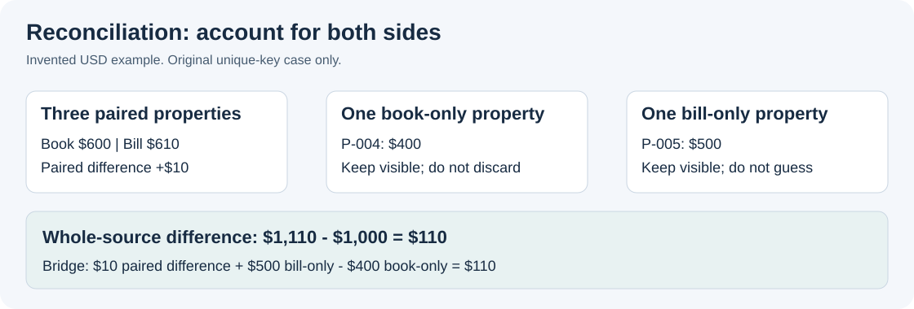

# Lesson 2: understand and check a spreadsheet

[Learning home](../LEARN.md) | Previous: [First conversation](01-first-conversation.md) | Next: [Research](03-source-backed-research.md)

**Goal:** inspect before editing, understand a formula, and verify a comparison.
**You need:** Claude chat for the text exercises; an approved file reader for workbook inspection.
Workbook creation requires the approved XLSX tools and native Excel checks described in setup.

## Choose the right help

| Today's task | Use | What must already work |
| --- | --- | --- |
| Explain a pasted formula | Normal Claude chat | No added skill is required |
| Inspect an unfamiliar workbook | Custom `excel-workbook-review` | An approved reader for that file |
| Create or edit a workbook | **Anthropic `xlsx`**, in `document-skills` | Installed package and compatible approved tools |
| Check a prepared reconciliation | Custom `reconciliation-control-review` | Supplied comparison, matching rules, and controls |

The README installs the custom skills in your **personal** `.claude/skills` folder. They can be
selected by matching requests as well as slash commands. Anthropic's Office toolkit is a
**separate recommended installation**: [follow its VS Code steps](../README.md#add-anthropics-office-skills-for-excel-work).
[Visual explanation of installation and selection](../guides/15-skills-made-visible.md).

## Apply it to today's work

Choose one operation: explain a formula **or** investigate one exception. Work from an approved
copy in the separate work folder. Use the tiny example below only if that operation is new.

```text
Guided mode. Using only [APPROVED WORKBOOK/SOURCE REFERENCES], help me [EXPLAIN ONE FORMULA /
DRAFT ONE EXCEPTION NOTE] for [SHEET, CELL OR RECORD; PERIOD]. Read-only; preserve originals.
Follow [KNOWN MATCH/SIGN RULES]. Give the useful explanation or note, cite the actual input
locations, and show the calculation if supported. Explain one unfamiliar step briefly.
Identify missing evidence; do not infer a cause or claim the whole workbook reconciles.
Give me one check I can perform in Excel. Do not refresh connections or run macros.
```

**Your part:** open the cited source and trace the inputs yourself. Report any mismatch specifically.
**Keep:** the checked explanation or exception note in the approved workpaper, including gaps.
**Next similar task:** write the request and name the check before looking back. Try a blank input
or duplicate key as a changed case; a method that silently treats either as resolved needs correction.



*Original diagram of the [first-session exercise](../practice/FIRST-SESSION.md). All amounts are invented USD dollars.*

## First understand what you have

In VS Code, confirm the right project is open. In Claude’s message box, type `@` and select one
actual approved synthetic workbook. With `excel-workbook-review` installed, add this natural request:

```text
Use the excel-workbook-review skill if available. Guided mode. Inspect only the selected synthetic workbook, read-only. Explain the purpose of each
sheet, identify the main tables and formulas, and list hidden or advanced features the tools can
actually inspect. Do not save, recalculate, refresh connections, or run macros. Explain one risk.
```

**Look for:** a sheet map, formula/cache distinctions, and explicitly unverified features. A reader
that cannot inspect Power Query should not say the workbook has no Power Query.

If selection is missing, type `/` and choose `excel-workbook-review` explicitly. Without that
skill, ask for the same bounded review in ordinary language. Without a file reader,
continue with the text example below; do not install software automatically to finish the lesson.

## Learn a formula on a tiny example

```text
Teach mode. In an invented sheet, A1 is Property, B1 is Book, and C1 is Bill. Row 2 contains
P-002, 200, and 210. Explain =C2-B2 in D2. What changes if C2 is blank rather than 210?
Suggest a way to make a missing input visible. Do not treat a missing bill as evidence of zero tax.
```

**Check:** with the supplied numbers the difference is **10**. Direct subtraction can treat an
empty referenced cell as zero, making the result look like **-200**. That is a formula result,
not proof that the bill is zero. For this tiny numeric example, one visible missing-input guard is:

```excel
=IF(OR(B2="",C2=""),"Missing input",C2-B2)
```

Test the formula in a practice copy in Excel with 210, an empty C2, and a numeric zero in C2.
Expected results: **10**, **Missing input**, and **-200**. This example does not validate text amounts,
errors, or every import format. For larger work, separate numeric results and exception statuses
into separate columns so charts and totals do not mix numbers with status text. Formula names and
separators can vary with Excel's language/locale.
[Microsoft: checking blank inputs](https://support.microsoft.com/en-us/excel/using-if-to-check-if-a-cell-is-blank),
[subtracting numbers](https://support.microsoft.com/en-us/excel/subtract-numbers-in-excel).

## Compare complete populations

Open the [first-session exercise](../practice/FIRST-SESSION.md). Copy its original BOOK and BILL
tables and run the first two steps, including the deliberate duplicate. Its answer key is your
independent check; the diagram above summarizes only the original unique-key case.

**Look for:** source totals, paired differences, both unmatched sides, and a visible duplicate-key
problem in the second step. Matching on property alone is insufficient if the same identifier can
appear in different jurisdictions or years. Define what one row represents before choosing keys.

## Make one tiny workbook with the official Excel skill

**Outcome:** create one new `.xlsx`, inspect it in native Excel, then use that file for a read-only
review. Do this when workbook creation is today's useful next step, after the text formula example.

1. In **VS Code**, choose **File > Open Folder** and open your existing `Practice-01`. In
   **View > Explorer**, confirm `inputs` and `outputs` exist. Keep real work in a separate project.
2. Open the **Claude Code** panel. In a fresh conversation, use this prompt. It names the official
   skill in normal language; alternatively type `/`, choose the installed XLSX command, and add it.

```text
Use the installed Anthropic XLSX skill for one invented practice workbook. First confirm the
skill and existing approved tools can create it; if unavailable, explain the missing capability
and stop without installing anything. Do not read unrelated work files or browse.
Create a NEW outputs/practice.xlsx. If it exists, use a new unused filename and report it.
One sheet, Practice: A1 Property, B1 Book, C1 Bill, D1 Difference.
Row 2: P-002, 200, 210. In D2 put =IF(OR(B2="",C2=""),"Missing input",C2-B2).
Keep the identifier as text. Use clear headers and readable column widths. No macros, external
links, data connections, or extra sheets. Explain one formula check. Report the actual output
path, whether formulas were calculated or only written, and any verification you could not do.
```

3. **Check the result in VS Code's file list:** expand `outputs`. A chat message saying the file
   was saved is insufficient; the actual reported `.xlsx` must be there. If creation was blocked,
   keep this exercise pending and continue learning with the text example.
4. **Open the actual file in Microsoft Excel:** in VS Code's Explorer, right-click that file and
   choose **Reveal in File Explorer**. In Windows File Explorer, double-click it. If Windows asks
   which app to use, choose the approved Microsoft Excel application. Do not enable macros or
   external content to run this example. VS Code may not render an `.xlsx` as a spreadsheet.
5. In Excel, check the sheet name, headers, and `P-002`. Select **D2** and read the formula bar.
   Confirm the initial displayed difference is **10**. Use **File > Save As** to make a separate
   `practice-check.xlsx` in your approved practice storage before testing changes.
6. In this check copy, clear **C2**: D2 should show **Missing input**. Enter numeric **0** in C2:
   D2 should show **-200**. Restore **210**: D2 should show **10**. If the value stays stale or an
   error appears, record the mismatch and inspect calculation settings with approved support.
   A plausible cached number is not enough. Keep the original generated file unchanged.
7. To practice input selection, return to Windows File Explorer. Copy the original generated
   workbook from `Practice-01/outputs` into `Practice-01/inputs` using **Ctrl+C**, then **Ctrl+V**.
   Cancel a replacement prompt and use a fresh copy name. Return to VS Code and expand `inputs`.
8. In a fresh Claude conversation, type `@inputs/` and choose that actual workbook. Ask:
   **“Review this workbook's sheets and formula risks, read-only, using excel-workbook-review.
   Do not save or recalculate it. Name one limitation and one Excel check.”** If needed, choose
   `/excel-workbook-review` explicitly. You have used Anthropic's creation skill and this kit's
   review skill for different parts of one task.

**Keep:** the original workbook, your check copy, and a short local note of observed results.
**Next similar task:** use a new output name and change the invented bill to 215. Predict and
verify the difference before reading Claude's answer. Do not repeat the package installation.
This small check does not establish preservation of PivotTables, Power Query, macros, or links.

## Move to a workbook only when the method is clear

Use step 3 of the exercise for a new workbook with approved XLSX tools. Open it in Excel, inspect
the formulas and answer-key totals, and check that identifiers remain text. A formatted workbook
is not proof that the formulas were calculated correctly.

An existing workbook with PivotTables, slicers, Power Query, VBA, or links needs additional feature
checks on a copy. Learn the available method in the [Excel playbook](../guides/08-excel-and-reconciliation-playbook.md).
Do not rebuild or convert a complex original just to follow this lesson.

Next: **[Lesson 3: research a specific rule](03-source-backed-research.md)**.
