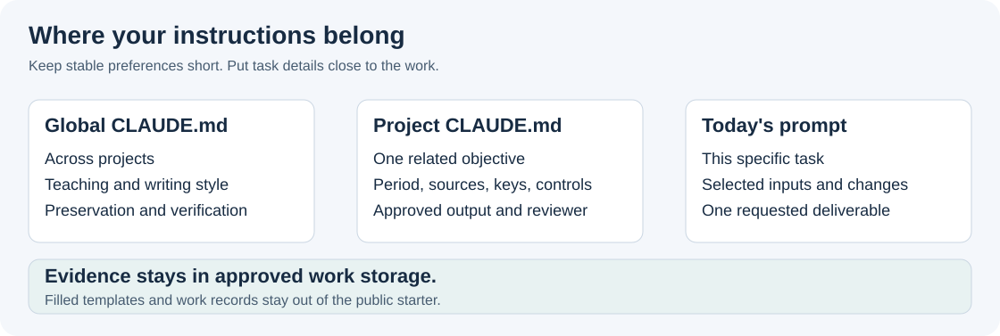

# Lesson 5: make the template your own

[Learning home](../LEARN.md) | Previous: [Reports](04-reports.md)

**Goal:** adapt a reusable method to one approved task without turning the public kit into a store
of work data. You can customize the examples, prompts, and project instructions locally.

## Apply it to today's work

Take one method you have already used and checked. Save its request pattern and check in an
approved local note using [this small template](../templates/WORK-TASK-NOTE.md). You do not need to
create a skill or configure memory to reuse a prompt.

**Your part:** on a later similar task, supply the new input and period yourself. Before running,
check whether the old rule and sources still apply. Use the note to catch omissions.
**Keep:** a reusable method with explicit conditions and a checked new result, not copied old facts.
**Use Routine mode when:** you can identify the inputs, request the operation, check its evidence,
and spot a changed condition that needs review. If one of those is difficult, use Guided for that
part. These are local learning cues, not certification or permission to skip professional review.



*Original teaching diagram of where to put information. These layers guide Claude; they do not
replace workplace policy, tool permissions, or source evidence.*

## Put information in the right place

| Place | Keep here | Example |
| --- | --- | --- |
| Global `CLAUDE.md` | Stable preferences that help across tasks | Explain unfamiliar terms; preserve originals; show checks |
| Project `CLAUDE.md` | The objective, period, source roles, exact rules, and output scope | One row represents a property/jurisdiction/year; approved match keys |
| Current prompt | Today's selected inputs, requested output, and changed facts | Review this period's selected export using the established controls |
| Approved evidence/work files | Detailed records, source versions, results, and review support | Exception workpaper and source register |

The public repository supplies **blank templates and invented examples**. Keep filled templates,
actual property details, organizational procedures, and work outputs in approved local/work storage.
Do not submit them to public issues or pull requests. An employer may permit some content in the
configured Claude service while prohibiting it in GitHub or public search.

## Customize one project

1. Choose one template from [project setup](../setup/PROJECTS.md).
2. Copy or merge it as `CLAUDE.md` in the approved work folder, preserving existing instructions
   and keeping a verified backup before replacement.
3. Replace placeholders with approved facts. Name the actual input through its approved reference;
   a neutral label alone does not tell Claude where the data is.
4. Define the match grain, keys, tolerances, output, and checks with the responsible reviewer.
   Leave unknown rules explicit rather than borrowing a number from an example.
5. Test the method on a small approved copy and then perform the required full-population controls.
   A successful sample is not full-population validation.

## Adapt the universal prompt

```text
Routine mode. For [PERIOD], produce [ONE OUTPUT] using only [APPROVED INPUT REFERENCES].
Follow this project's documented [RULES AND CONTROLS]. Preserve originals and write only to
[APPROVED NEW OUTPUT]. Show source versions, counts/totals or citations, exceptions, and checks.
If a required rule or source is missing, explain the specific gap and continue unaffected work.
```

For a research task, replace accounting controls with jurisdiction, tax year, source hierarchy,
effective-period checks, and pinpoint citations. For a document task, name the audience, evidence,
format, and rendering check. You are adapting the method, not forcing every job into a spreadsheet.

## Improve gradually

When a correction repeats, ask for one proposed instruction change:

```text
We repeatedly need [GENERIC CHECK]. Suggest a small addition to this project's instructions.
Show the exact wording, why it belongs here, and any conflict with existing rules. Do not save it
until the change is approved. Keep the global file focused on preferences shared across projects.
```

A skill is useful for a stable repeated procedure; a prompt is enough for an occasional task.
Use the [catalog](../SKILLS.md) before creating another skill. More files and longer instructions
are not automatically better. Use only relevant approved context and measure correction effort
as well as token use.

## Your next real task

Choose one low-complexity approved task, use Guided mode, and check the result with a reviewer.
Record what worked, what remained unavailable, and the next useful step. Expand to larger files,
more jurisdictions, or richer reports only when the method and checks are understood.

Continue with [daily use](../guides/DAILY-USE.md), [the prompt library](../prompts/PROMPT-LIBRARY.md),
or [the work-based progression](../guides/10-four-week-learning-path.md). Return to any lesson when needed.
