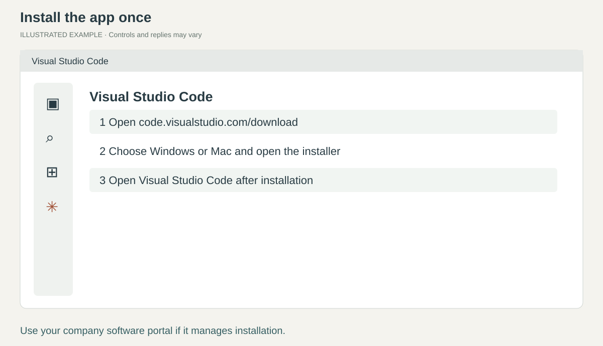
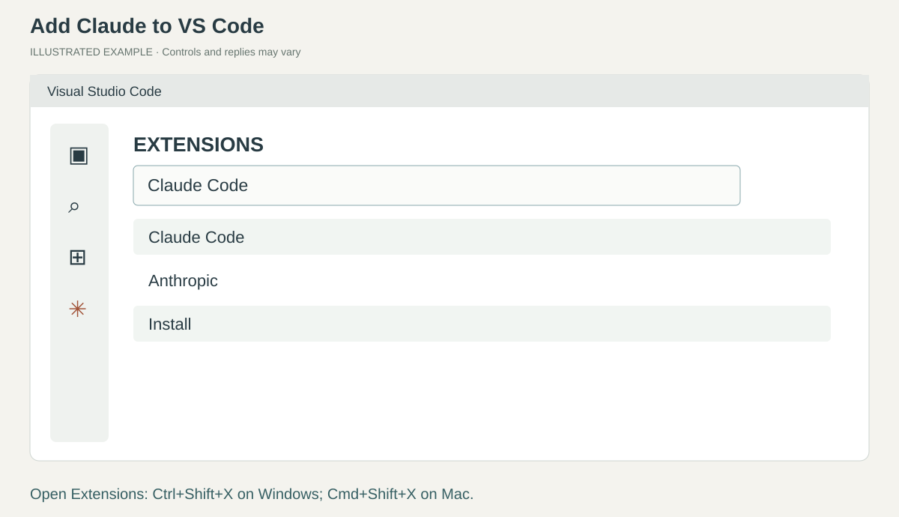
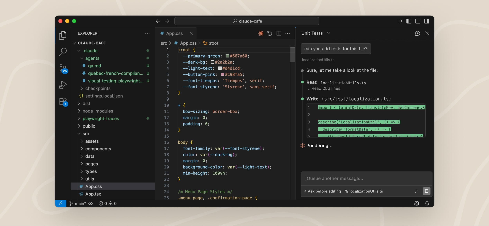
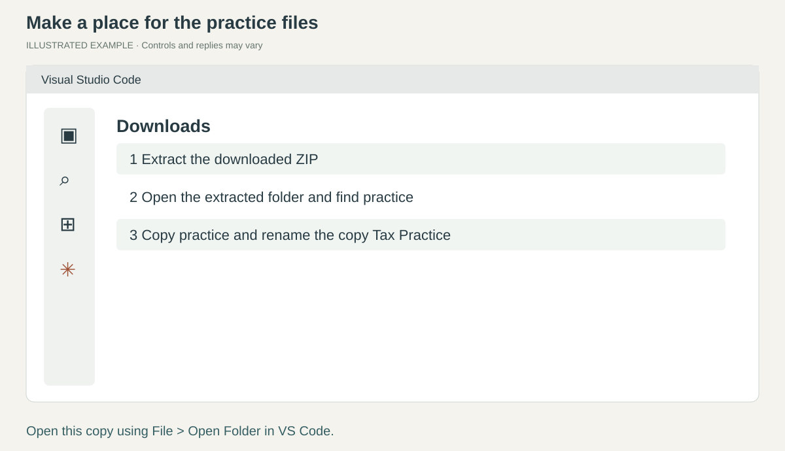
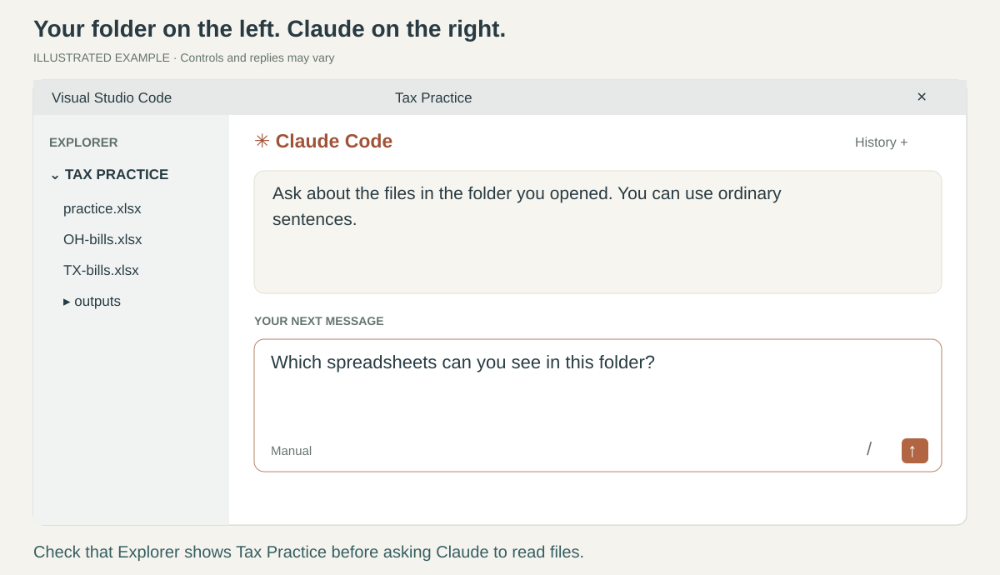

# 1. Open Claude

[Home](../README.md) · Page 1 of 5 · [Next: add skills](02-skills.md)

Your first goal: see Claude's message box and get a reply. If an app is already installed,
skip its installation. Use your company's software portal and Claude connection when provided.

## 1. Install and open VS Code

Open [the VS Code download page](https://code.visualstudio.com/download).
Choose **Windows** (or **Mac**), open the downloaded installer, and follow its prompts.
On Windows, open **Start**, type **Visual Studio Code**, and click the app.
On Mac, open it from **Applications**. If your company manages installs, use its software portal or ask IT.

**You are there when:** a Visual Studio Code window opens. You can close welcome tabs.

## 2. Install the Claude Code extension

In VS Code, press **Ctrl+Shift+X** (Mac: **Cmd+Shift+X**).
This opens **Extensions**, where you add features to the app.
Search **Claude Code**, choose the result published by **Anthropic**, and click **Install**.

Then press **Ctrl+Shift+P** (Mac: **Cmd+Shift+P**). This opens the **Command Palette**,
a search box for app actions. Type **Claude Code** and choose **Claude Code: Open in New Tab**.

**You are there when:** the Claude panel opens. If the option is missing, [reload the window](../HELP.md#reload-the-window).

## 3. Sign in and send your first message

*Real reference screenshot from [Anthropic](https://code.claude.com/docs/en/vs-code).
Their example contains code. Your work will contain spreadsheets. The message box is at the bottom of the Claude panel.*

Click **Sign in** if prompted and follow your approved account's browser sign-in steps.
If your company supplied a connection, follow its instructions instead.
Return to VS Code. Click inside **Claude's message box** and type:

> I'm new here. Help me work with Excel, one step at a time.

Press **Enter** to send. Use **Shift+Enter** if you want a new line in a longer message.
You can also dictate using a dictation app you already use.

**You are there when:** Claude replies. This is the box you will use throughout the course.
The separate VS Code Chat button can open another assistant. Look for **Claude Code**.

## 4. Get the practice files

[Download the practice kit](https://github.com/jasonjeske/vscode-claude-code/archive/ff00cbe215563d730e5022b734987ea01a303fd0.zip).
In Windows **File Explorer**, open **Downloads**, right-click the ZIP, and choose **Extract All**,
then **Extract**. On Mac, double-click the ZIP in Finder.

Open the extracted folder until you see **practice**. Copy that folder to your approved learning
location and rename the copy **Tax Practice**. Keep its contents together.

**You are there when:** Tax Practice contains **practice.xlsx**, **OH-bills.xlsx**, **TX-bills.xlsx**,
and two text documents. Everything in these spreadsheets is invented.

## 5. Open that folder in VS Code

Choose **File > Open Folder**, select **Tax Practice**, then **Select Folder** (Mac: **Open**).
If asked whether you trust the folder, review its source and follow your company's policy.
Open the Claude panel again with the Command Palette if necessary.

The **Explorer** on the left lists your files. You can ignore the editor in the middle for now.
In Claude's message box, say:

> Which spreadsheets can you see in this folder?

**You are there when:** Claude names the three practice spreadsheets.
If it names other files, open the correct folder before continuing.

**Next: [Add your skills once](02-skills.md).**
