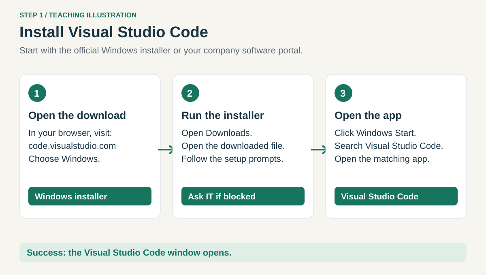
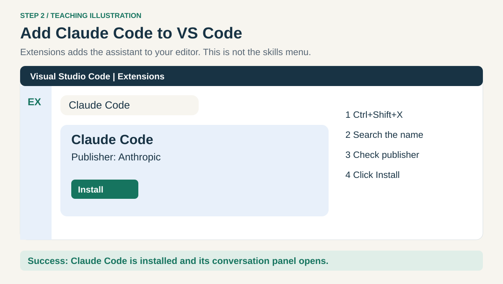
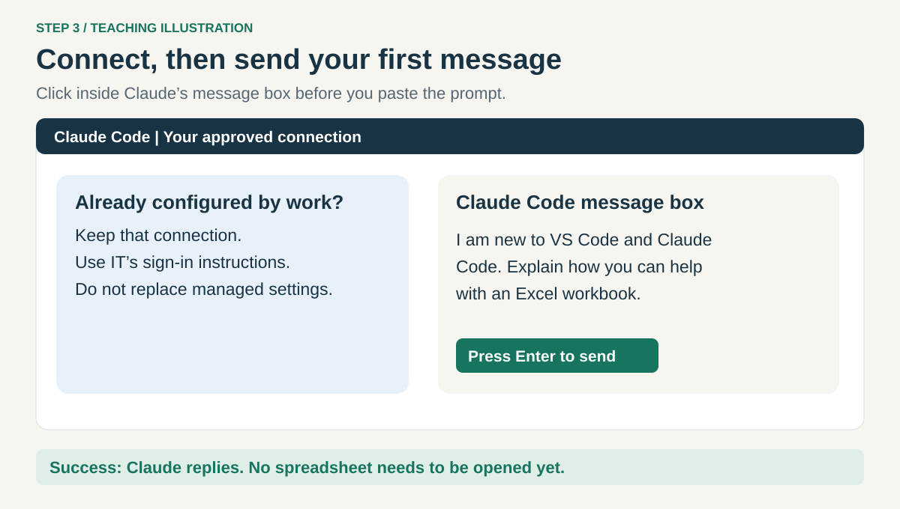
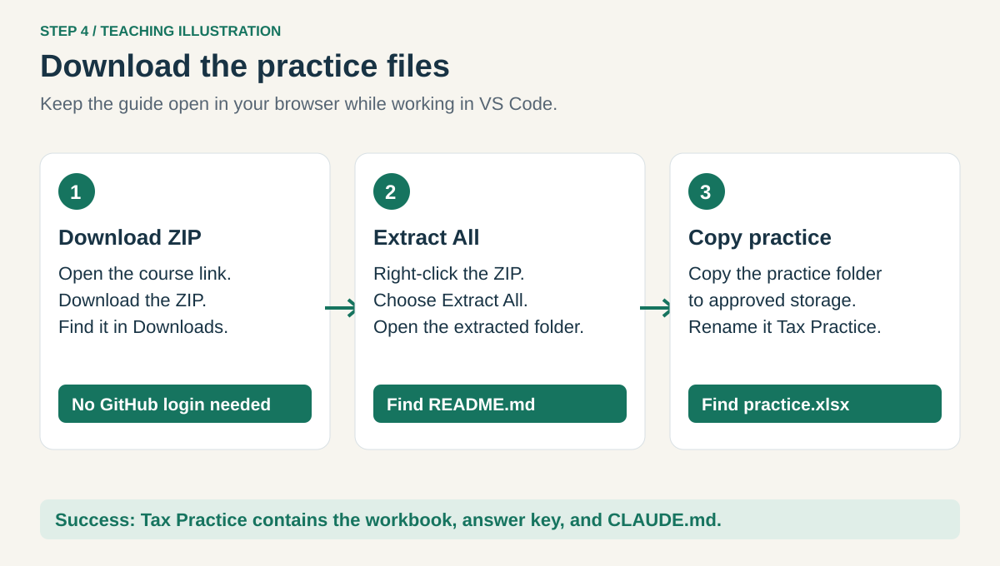
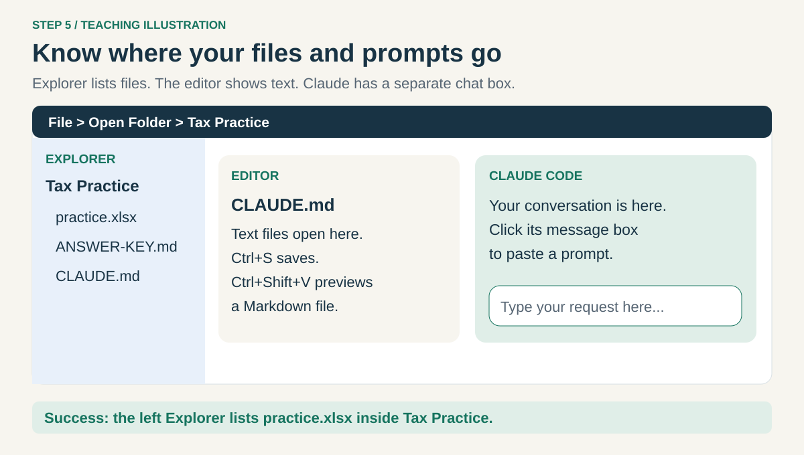

# 1. Set up your workspace

[Home](../README.md) · **Set up** → [Skills](02-skills.md) → [Excel](03-excel.md) → [Dashboard](04-dashboard.md)

You need a Windows computer, Excel, and your employer-approved way to use Claude Code.
If an app is already installed, open it and skip its installer.

## Step 1. Install and open VS Code



Open [VS Code for Windows](https://code.visualstudio.com/docs/setup/windows) in your browser.
Use your company's software portal if required; otherwise download the Windows installer, open it
from **Downloads**, and follow its prompts. Open **Visual Studio Code** from Windows **Start**.
This is a different app from Visual Studio. If installation is blocked, ask IT to install it.

**Check:** a window titled Visual Studio Code opens.

## Step 2. Add the Claude Code extension



In VS Code, press **Ctrl+Shift+X**. This opens **Extensions**, the add-on store.
Search **Claude Code**, choose the extension published by **Anthropic**, and click **Install**.
Then press **Ctrl+Shift+P**, type **Claude Code**, and choose **Open in New Tab**.
If it does not appear, use [Reload Window](../HELP.md#reload-claude-code).

**Check:** you can see a Claude Code conversation panel. See [Anthropic's extension guide](https://code.claude.com/docs/en/vs-code).

## Step 3. Connect and try one message



If your company already configured the connection, keep it. Otherwise follow IT's instructions
for its gateway or sign-in. For an approved direct Anthropic account, use the extension's sign-in
prompt. Do not create a personal account or paste keys to work around a company connection error.

Click the **Claude Code message box**, paste this, and press **Enter**:

```text
I am new to VS Code and Claude Code. Explain what you can help me do with an
Excel workbook in three short sentences. Do not read or change any files yet.
```

**Check:** Claude replies. You do not need a separate terminal installation to use this chat panel.

## Step 4. Download the practice folder



[Download this repository as a ZIP](https://github.com/jasonjeske/vscode-claude-code/archive/refs/heads/main.zip).
Open **Downloads** in Windows File Explorer. Right-click the ZIP → **Extract All** → **Extract**.
Open the extracted folder until you see `README.md`, `lessons`, and `practice` together.
Copy the **practice** folder to your approved learning location and rename the copy **Tax Practice**.
You do not need a GitHub account, Git, or a terminal.

**Check:** Tax Practice contains `practice.xlsx`, `ANSWER-KEY.md`, and `CLAUDE.md`.
The workbook contains invented Ohio records, not actual tax data.

## Step 5. Open Tax Practice in VS Code



Choose **File → Open Folder** in VS Code. Select **Tax Practice**, then **Select Folder**.
If Workspace Trust appears, trust it only after reviewing the source and following company policy.
Open the Claude panel again using **Ctrl+Shift+P → Claude Code → Open in New Tab** if needed.

The left **Explorer** lists files. Click `CLAUDE.md` to open it in the middle **editor**.
A `.md` file is a plain text document with simple formatting, called Markdown.
Press **Ctrl+Shift+V** while that file is active to see its formatted preview.
The Claude message box is where you paste the course prompts.


*Reference screenshot © Microsoft, [CC BY 3.0 US](../assets/reference/ATTRIBUTION.md). Your files and Claude panel will differ.*

**Check:** the Explorer says **Tax Practice** and lists `practice.xlsx`.
Open spreadsheets in Excel for viewing; a binary-file message in VS Code is normal.

**Next: [2. Add skills](02-skills.md).**
