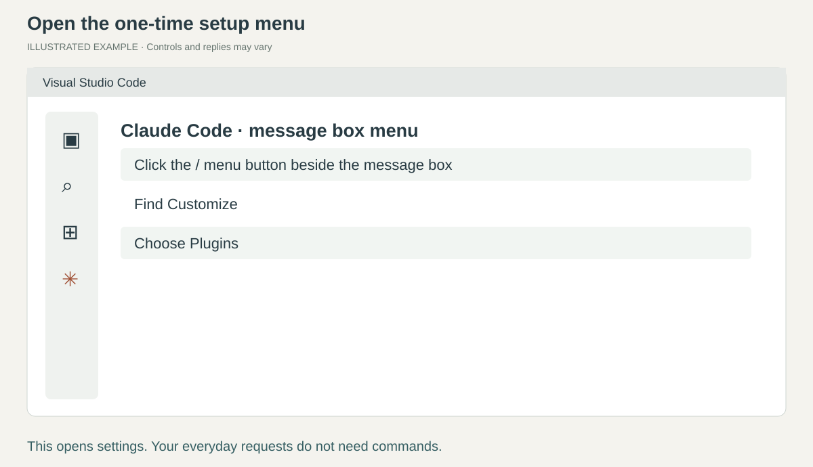
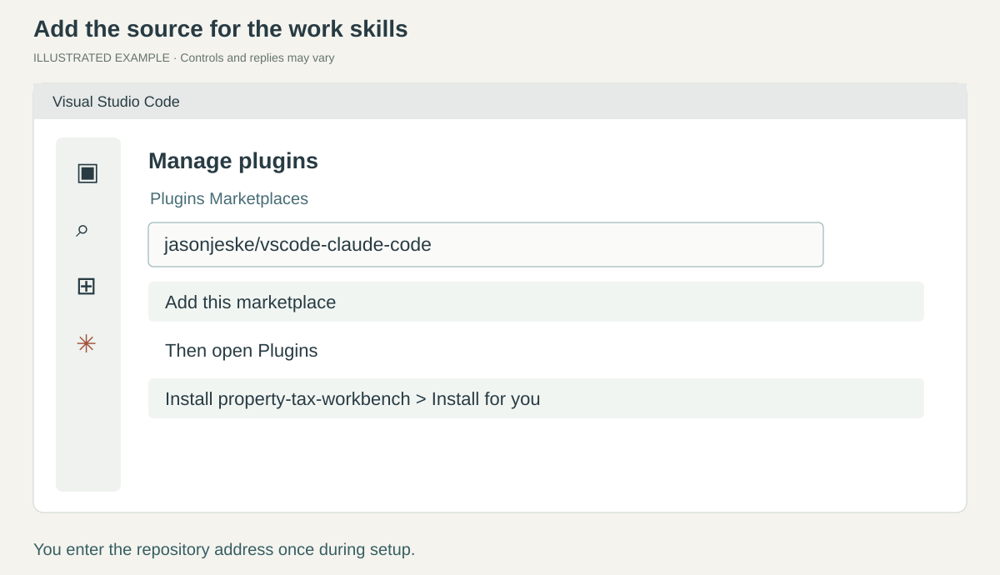
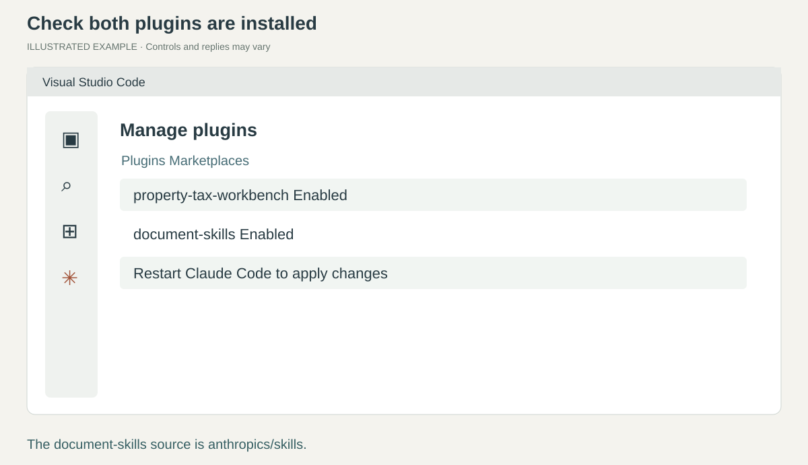
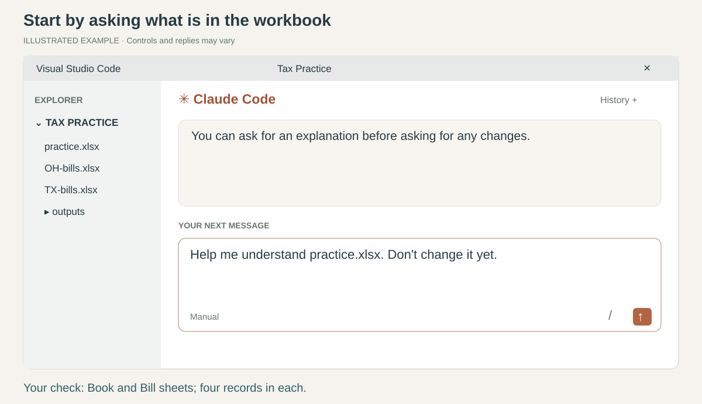
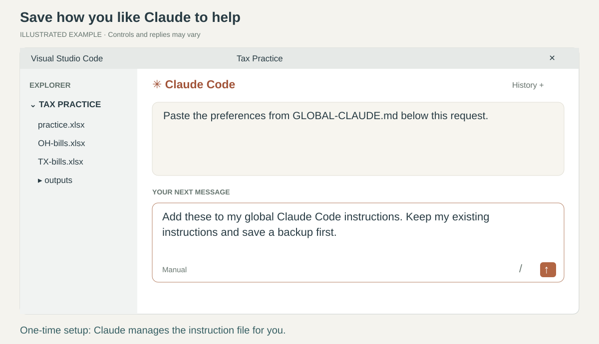

# 2. Add your skills once

[Home](../README.md) · [Back](01-setup.md) · Page 2 of 5 · [Next: spreadsheets](03-excel.md)

A **skill** is a reusable work procedure Claude can follow. A **plugin** installs a group of skills.
This page is the one-time setup. Your everyday work will use ordinary sentences.

*Pictures on this page are simplified illustrations of the controls described in
[Anthropic's extension guide](https://code.claude.com/docs/en/vs-code#manage-plugins).
Labels and positions can change between versions.*

## 1. Open the plugin window

Find the small **/** menu button beside Claude's message box. **Click it**.
Under **Customize**, choose **Plugins**. This is a settings menu; you do not need to type a skill command.

**You are there when:** **Manage plugins** appears with **Plugins** and **Marketplaces** tabs.
If you do not see Plugins, [update the extension](../HELP.md#update-the-extension).

## 2. Add the property-tax kit

Click **Marketplaces**. A marketplace is a source from which Claude can install plugins.
In the field for adding a source, enter this repository address once:

~~~text
jasonjeske/vscode-claude-code
~~~

Add it, then return to **Plugins**. Find **property-tax-workbench**, click **Install**,
and choose **Install for you** so it is available in your other work folders.

**You are there when:** it appears under installed plugins and is switched on.
If company policy blocks it, ask IT to review this repository.

## 3. Add the spreadsheet tools and restart

In **Marketplaces**, add **anthropics/skills** the same way.
Back in **Plugins**, find **document-skills** from **anthropic-agent-skills**.
Click **Install > Install for you**. This is Anthropic's document package, including its Excel skill.

Click the banner to **restart Claude Code** when prompted. If no banner appears, follow
[Reload the window](../HELP.md#reload-the-window). Start a fresh conversation after restarting.

**You are there when:** both plugins appear installed and enabled.
You do not need to reinstall them every time you open VS Code.

## 4. Try it with your own words

In Claude's message box, say:

> Help me understand practice.xlsx. Don't change it yet.

Claude should read the file, use relevant available skills, and explain the two sheets.
If it asks to run a tool, ask what it will do if you are unsure, then approve the action you understand.
If a required spreadsheet tool is missing, ask:

> Tell me exactly what I should ask IT to install so you can read and create Excel files.

**You are there when:** Claude reports the **Book** and **Bill** sheets from the actual workbook.
A list of installed skills alone is not this check. If it misses a helper, say:

> Check the installed skills and use the relevant ones for this workbook.

You can describe a task briefly or in detail. Correct Claude or add requirements in your next message.

### Optional: save your usual preferences

Open [GLOBAL-CLAUDE.md](../GLOBAL-CLAUDE.md) in your browser. Copy the text in its copy box.
In Claude's message box, type the following sentence, paste the preferences underneath, and send:

> Add these to my global Claude Code instructions. Keep my existing instructions and save a backup first.

Claude should explain the change, save it to its user-level **CLAUDE.md**, and report the location.
This is Claude Code's persistent instruction file. It is separate from the Claude website's profile preferences
and VS Code's settings. You do not need to edit a settings file yourself.

**Check:** open a new conversation and ask, “What are my saved working preferences?”
If your company manages these instructions, have IT approve the addition.

**Next: [Work with spreadsheets](03-excel.md).**
