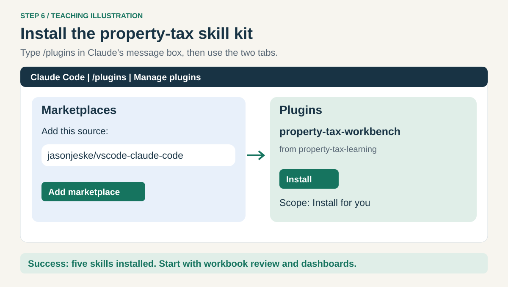
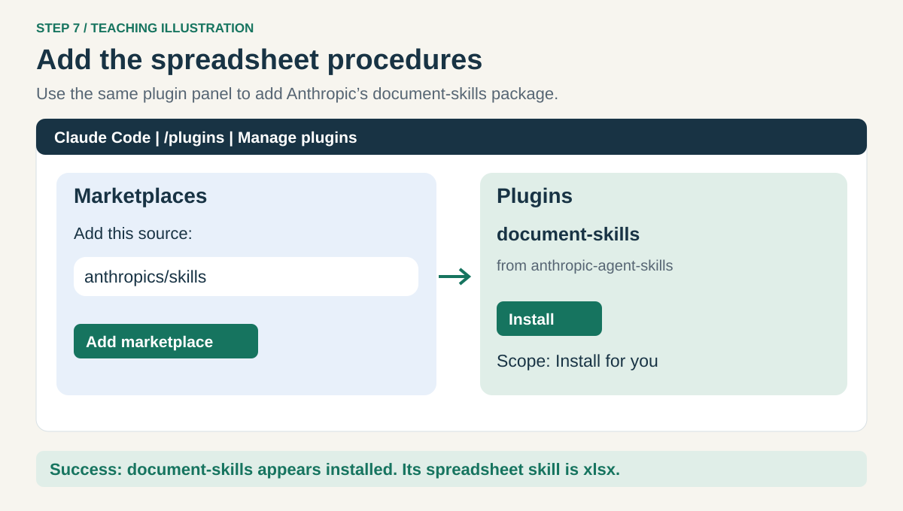
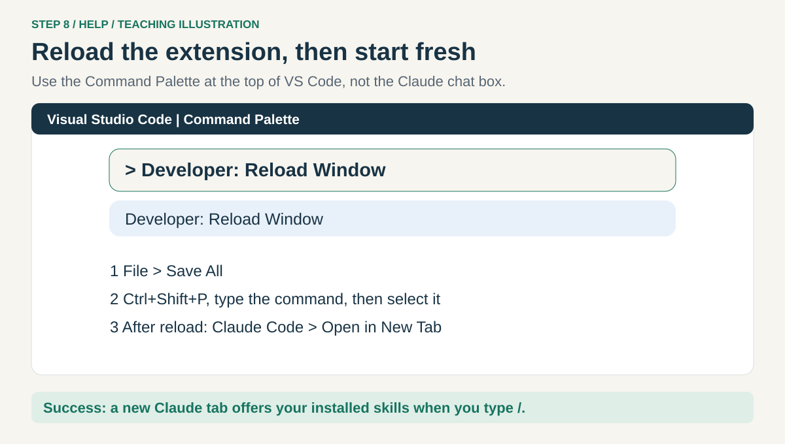
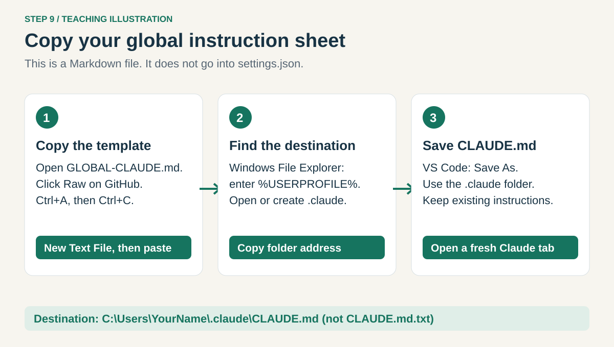

# 2. Add skills and your instructions

[Home](../README.md) · [Set up](01-setup.md) → **Skills** → [Excel](03-excel.md) → [Dashboard](04-dashboard.md)

Install once, then reuse. A skill teaches Claude a process; it does not install Excel or give it
permission to access your company systems. Use the approved installation route at work.

## Step 6. Install the property-tax skills



In the **Claude message box**, type `/plugins` to open **Manage plugins**.
Select **Marketplaces** and add this source:

```text
jasonjeske/vscode-claude-code
```

Return to **Plugins**. Find **property-tax-workbench** from **property-tax-learning**.
Choose **Install**, then **Install for you** if permitted, so it works across your folders.
If policy requires a different scope, let IT select it. This installs just two skills:

| Skill | Use it for |
| --- | --- |
| `excel-workbook-review` | Understand a workbook and compare book amounts with bills |
| `financial-dashboard` | Turn checked results into an Excel or local browser report |

**Check:** property-tax-workbench appears in your installed plugins. If the panel is unavailable,
[use the help page](../HELP.md#plugins-or-skills-are-missing). [Official plugin interface](https://code.claude.com/docs/en/vs-code#manage-plugins).

## Step 7. Add Anthropic's spreadsheet skill



In the same **Marketplaces** panel, add:

```text
anthropics/skills
```

Under **Plugins**, install **document-skills** from **anthropic-agent-skills** with the same scope.
It includes `xlsx` for spreadsheet procedures, plus Word, PDF, and PowerPoint skills. Use the
package only when its license and tools are approved for your work; its terms are separate from
this guide. [Official package and terms](https://github.com/anthropics/skills).

**Check:** both packages appear installed. Libraries needed to process Excel files may still be
missing. The practice lesson will check that before doing work; a skill menu alone is not proof.

## Step 8. Reload and check the skills



Save open edits with **File → Save All**. Press **Ctrl+Shift+P** and type
**Developer: Reload Window**. Click that command; VS Code briefly reloads.
Then press **Ctrl+Shift+P**, type **Claude Code**, and choose **Open in New Tab** for a fresh conversation.
If the plugin panel offers a restart first, use it too.

In the new Claude message box, type `/` and look for:

```text
/property-tax-workbench:excel-workbook-review
/property-tax-workbench:financial-dashboard
/document-skills:xlsx
```

**Check:** you can select the installed skills. Use the names shown by your actual menu if they differ.
Do not paste slash commands into the Command Palette or PowerShell.

## Step 9. Copy your global CLAUDE.md



This is your reusable instruction sheet. **Claude Code reads it from a file; do not paste it into
`settings.json` or the Claude website's profile preferences.**

Open [GLOBAL-CLAUDE.md](../GLOBAL-CLAUDE.md) in your browser. On GitHub, click **Raw**, then
**Ctrl+A → Ctrl+C** to copy just the text. In VS Code choose **File → New Text File**, then **Ctrl+V**.

In **Windows File Explorer** (the folder app), click the address bar, type `%USERPROFILE%`,
and press **Enter**. Open `.claude`; if missing, create it using **New → Folder**.
Copy that folder's full address. Back in VS Code press **Ctrl+Shift+S** (**Save As**), paste the
folder address into the dialog's address bar, and save the file as **CLAUDE.md**.

**If that file already exists:** cancel the replacement, open the existing file, save a backup
copy, and append only the relevant instructions. Keep company-managed instructions intact.
The final location is `C:\Users\YourName\.claude\CLAUDE.md`, without an extra `.txt` suffix.
[Official instruction locations](https://code.claude.com/docs/en/memory).

Open another fresh Claude tab and paste:

```text
Read my user-level .claude/CLAUDE.md. Confirm its path and summarize the
instructions about teaching beginners and preserving original workbooks.
If you cannot read it, say so. Do not change it.
```

**Check:** the reported path is under your Windows user folder. The separate `CLAUDE.md` in
Tax Practice applies only to that practice folder.

**Next: [3. Analyze Excel](03-excel.md).**
