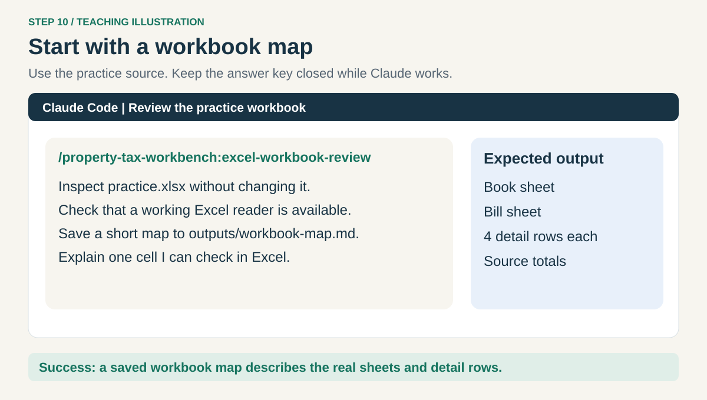
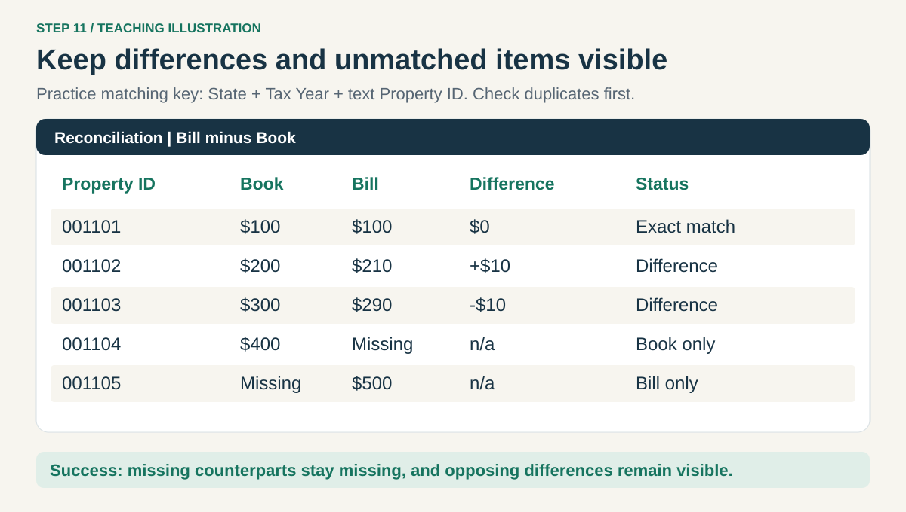
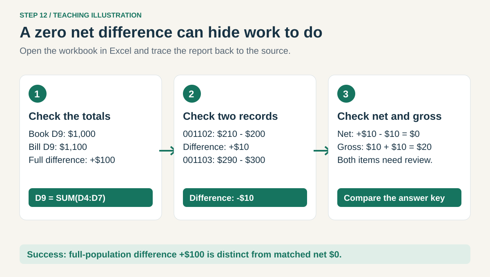

# 3. Analyze your first Excel workbook

[Home](../README.md) · [Set up](01-setup.md) → [Skills](02-skills.md) → **Excel** → [Dashboard](04-dashboard.md)

Use the **Tax Practice** folder. Each prompt goes in the **Claude Code message box**.
Select the skill from `/` if autocomplete appears, then paste the rest of the request.

## Step 10. Inspect the workbook



Paste:

```text
/property-tax-workbench:excel-workbook-review
I am learning. Inspect practice.xlsx without changing it. Use the installed
xlsx skill if useful. First check whether you have working tools to read
.xlsx files. If anything is missing, name the dependency and stop before
installing it. Do not read ANSWER-KEY.md.
Tell me the sheet names, what one detail row means, the number of detail
rows, and the total on each sheet. Save a short map to outputs/workbook-map.md.
Explain one source cell I can check in Excel.
```

Claude may request permission to run a reader or create `outputs`. Read the proposed action.
Approve only the intended input, output, and commands you understand. If unclear, ask
“Explain this permission in plain English before I approve.”

If a reader is missing, give its exact name and purpose to IT. Ask Claude to retry this small
workbook after the approved tools are installed. Node.js alone is not an Excel reader.

**Check:** click `outputs` in VS Code Explorer, then `workbook-map.md`. It should name
**Book** and **Bill**. A response that only guesses from the filename is not a completed review.

## Step 11. Compare the book and bill records



In the same conversation, paste:

```text
/property-tax-workbench:excel-workbook-review
Compare the Book and Bill sheets in practice.xlsx. Use detail rows only.
Check for duplicate keys first. Match State + Tax Year + Property ID,
keeping IDs as text. Calculate Bill minus Book for unique matches.
Show exact matches, amount differences, book-only items, and bill-only items.
Show source counts/totals, signed net and absolute gross matched differences,
and a bridge from the book total to the bill total. Do not infer missing
amounts as zero or guess causes. Save the findings to outputs/reconciliation.md
and the result rows to outputs/reconciliation.csv. Keep practice.xlsx unchanged.
Do not use ANSWER-KEY.md. Explain why a zero net difference can hide errors.
```

**Check:** the report includes unmatched records and individual differences even when the
matched net is zero. If duplicate keys exist, investigate before forcing a match.

## Step 12. Check the result yourself in Excel



In Windows File Explorer, open **Tax Practice**, then double-click **practice.xlsx** to open Excel.
Click the **Book** sheet tab, then cell **D9**: **$1,000**. On **Bill**, D9 is **$1,100**.
Click D9 and look at the formula bar: `=SUM(D4:D7)` counts the four detail rows.

Compare property `001102`: Book **$200**, Bill **$210**, difference **+$10**.
Compare `001103`: Book **$300**, Bill **$290**, difference **-$10**.
The net is **$0**, but gross differences total **$20**. These are two items to investigate.
Close the source without saving. Use the full [answer key](../practice/ANSWER-KEY.md) to check the rest.

**Check:** your report shows a full-population difference of **+$100**, separate from the
**$0 matched net**. If it disagrees, paste the mismatch and ask Claude to trace the source cells.
Do not simply ask Claude to change its answer to the expected number.

**Next: [4. Make a dashboard](04-dashboard.md).**
