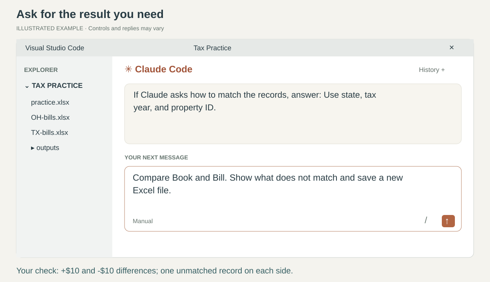
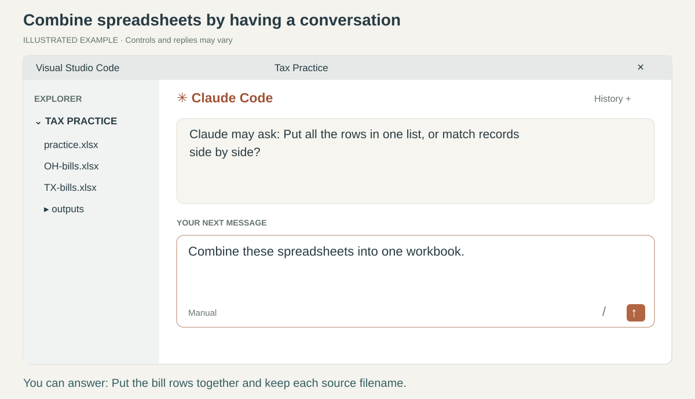
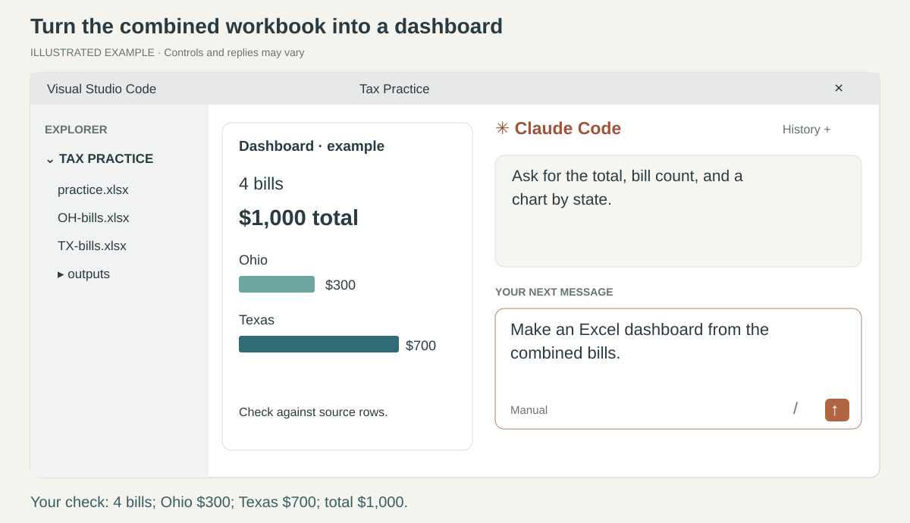
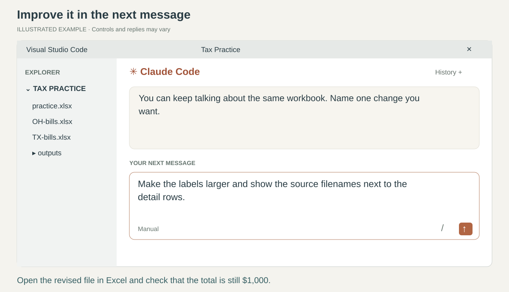

# 3. Work with spreadsheets

[Home](../README.md) · [Back](02-skills.md) · Page 3 of 5 · [Next: research](04-research.md)

Use **Tax Practice** in VS Code. Keep your original files unchanged.
The pictures below are illustrated conversations and example outputs, not recorded Claude responses.
Use your own words; there is no special command to remember.

## 1. Understand a workbook

Say:

> Help me understand practice.xlsx. Don't change it yet.

If you already did this on the last page, continue to step 2.
Claude should explain **Book** and **Bill**, the two sheets in the workbook.
A workbook is the Excel file; a sheet is one tab inside it.

**Check in Excel:** open Windows File Explorer (Mac: Finder), go to Tax Practice, and double-click
**practice.xlsx**. Click the **Book** and **Bill** tabs at the bottom. Each has four records.
Book totals **$1,000** and Bill totals **$1,100**.

If VS Code says it cannot display the spreadsheet, that is normal. Open it in Excel to view it.

## 2. Compare the book and the bill

Return to Claude and say:

> Compare Book and Bill. Show what doesn't match and save it in a new Excel file.

If Claude asks how to match these practice records, answer:

> Use state, tax year, and property ID. Show Bill minus Book.

If it asks where to save the result:

> Make an outputs folder here and save it there.

An **outputs** folder holds Claude's finished files. Claude can create it for you.
Read any permission request before approving it. If you do not understand it, say,
“Explain what this will change before I approve.”

**Check:** Claude should find one exact match, two matched differences (**+$10** and **-$10**),
one book-only property (**$400**), and one bill-only property (**$500**).
The full difference is **+$100**. The two matched differences cancel to zero but still need review.

Open the new file in Excel. Trace the **+$10** difference to property **001102** in both source sheets.
If the result is wrong, say which number differs and ask Claude to investigate.
Do not accept a claim of success without opening the saved file.

## 3. Combine two separate spreadsheets

Now use the **other two** files in Tax Practice. They contain separate, invented bill lists.

> Combine OH-bills.xlsx and TX-bills.xlsx into one new Excel workbook.

Claude may ask whether to put the rows together or match records side by side. Answer:

> Put all the bill rows in one list. Keep a column showing which file each row came from.

If it finds different column headings, ask it to explain the proposed mapping before proceeding.
For real work, tell it about columns with different meanings. A bill amount and an assessed value
should not become the same column.

**Check:** the combined list has **4 detail rows**, totaling **$1,000**:
**Ohio $300** plus **Texas $700**. It must not count either source's Total row as another bill.
The property IDs still begin with zeros, and both source filenames appear.
This exercise is separate from the Book/Bill comparison.

## 4. Make an Excel dashboard

Continue in the same conversation:

> Make an Excel dashboard from the combined bills. Show the total, bill count, and a chart by state.

Claude should save a new workbook with a **Dashboard** sheet and supporting detail.
It may ask about the layout. You can answer, “Keep it simple and easy to read.”

When Claude finishes, ask:

> Show me where you saved it and how to open it in Excel.

**Check:** open the workbook in Excel. It should show **4 bills**, **$1,000 total**, **Ohio $300**,
and **Texas $700**. Check the chart against the detail rows.
If it includes filters, try each state and clear the filter again.
Ask whether the displayed totals are designed to change with filtering; do not assume they do.

If you prefer a browser dashboard later, say, “Also make a dashboard I can open in my browser.”
For this first exercise, finish and check the Excel version.

## 5. Improve it by talking

You do not need to know formatting commands. Try one change:

> Make the labels larger and show the source filenames next to the detail rows.

Then ask:

> Check that the totals still match the source files. Tell me what I should check in Excel.

**Check:** open the revised file and see the change. The total should still be **$1,000**.
A saved chart or formula is not proof of correct Excel calculation. Review it in Excel before work use.

**Try it yourself:** without copying a prompt, ask Claude to sort the combined detail by bill amount,
largest first. Verify the first amount is **$400**.

When comfortable, repeat in a separate folder containing a few employer-approved copies.
Tell Claude which files to use. Keep the original workbooks outside its output folder.

**Next: [Research a tax question and use the findings](04-research.md).**
