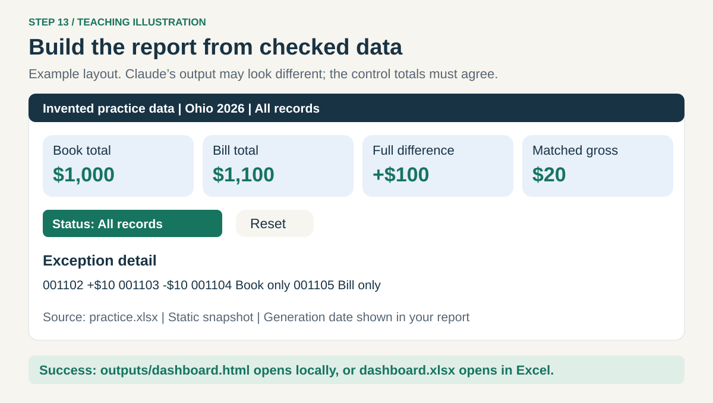
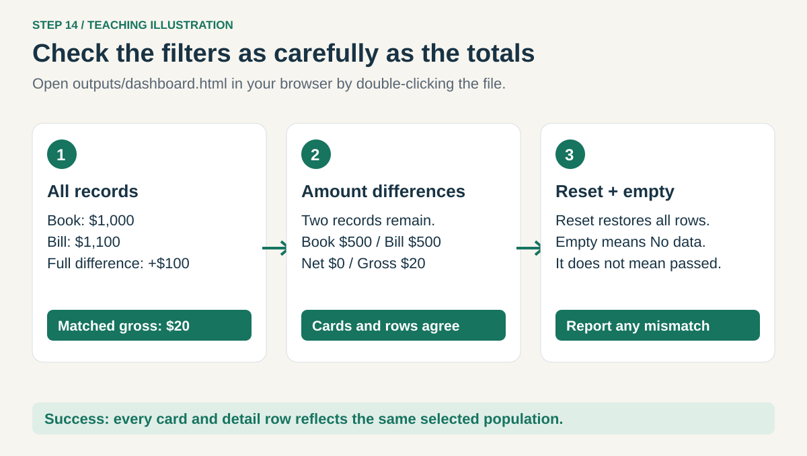
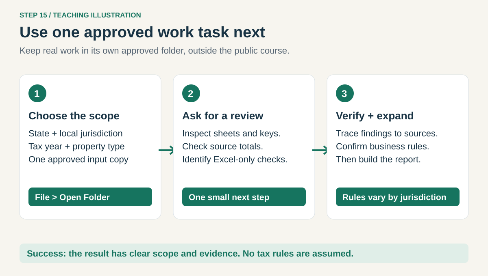
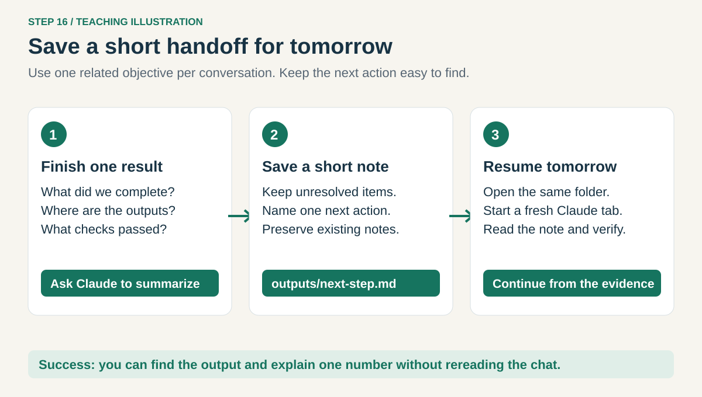

# 4. Make a dashboard and repeat the method

[Home](../README.md) · [Set up](01-setup.md) → [Skills](02-skills.md) → [Excel](03-excel.md) → **Dashboard**

## Step 13. Turn checked results into a dashboard



After checking the reconciliation, paste into Claude:

```text
/property-tax-workbench:financial-dashboard
Build outputs/dashboard.html from practice.xlsx and our checked reconciliation.
Label it Invented practice data - Ohio 2026. Use one self-contained HTML file
that opens by double-clicking, with no external scripts, fonts, or services.
Show Book total, Bill total, full-population difference, and matched gross
difference. Include an exception table with state, year, text property ID,
book amount, bill amount, signed difference, and status. Missing stays missing.
Add a status filter and reset button. All cards and rows must reflect the same
selection. Include a no-data state, source filename, and generation date.
Keep original files unchanged. Test totals, filters, reset, and empty results.
Report any browser checks you cannot perform. Explain how I open the file.
```

**Check:** `outputs/dashboard.html` exists. HTML is a web page file. This one should run locally
without a server or Node.js. The image shows the target structure, not a promised exact design.

**Prefer an Excel dashboard?** Use this prompt instead of the HTML prompt:

```text
/property-tax-workbench:financial-dashboard
Use the installed xlsx skill to create outputs/dashboard.xlsx from our checked
practice reconciliation. Include Summary and Exceptions sheets, clearly labeled
source totals, full-population difference, matched gross difference, and a
simple Book versus Bill chart. Preserve text IDs and missing values.
Keep practice.xlsx unchanged. Reopen the new file and check source-to-output
counts and totals. Tell me which formulas and charts I must verify in Excel.
Do not claim native Excel verification unless it actually ran.
```

## Step 14. Open and test your dashboard



In Windows File Explorer, open **Tax Practice → outputs** and double-click **dashboard.html**.
If Windows asks, choose your approved browser. If you made `dashboard.xlsx`, open it in Excel.
A local HTML report is a snapshot: it will not update when the source workbook changes.

For the HTML version, compare these results:

| Selection | What should happen |
| --- | --- |
| All records | Book $1,000; Bill $1,100; full difference +$100; matched gross $20 |
| Amount differences | Two records; Book $500; Bill $500; net $0; matched gross $20 |
| Reset | The original totals and all records return |
| A selection with no rows, if available | Explicit “No data”, not a successful reconciliation |

If the controls cannot produce an empty selection, ask Claude to test that case with temporary
invented input and report the result. Never overwrite your practice source to test it.
For Excel, check Summary amounts against the answer key, the Exceptions rows, and the chart's source range.

**Check:** every card and row agrees with the selected records. Send any mismatch back to Claude
with the exact filter and expected source total. Recheck after the fix.

## Step 15. Repeat on one approved work task



Create a **separate approved work folder** in Windows File Explorer. Put an approved **copy** of
one input workbook there. Use **File → Open Folder** in VS Code and select that folder.
Use a fresh Claude conversation. The installed user-scope skills and global instructions remain
available. Keep real data out of the downloaded public guide and GitHub.

Replace the square-bracket placeholders before pasting:

```text
/property-tax-workbench:excel-workbook-review
Help me review [filename.xlsx] for [state], [county or local jurisdiction],
[tax year], [real or personal property], in [currency/units].
My goal is [specific comparison]. First inspect the sheets, keys, dates,
formulas, and source totals without changing the file. Identify macros,
PivotTables, Power Query, or links that need native Excel checks.
Ask one question if a missing business rule affects the result.
Propose one small next step and an output in this folder's outputs directory.
Do not infer rates, exemptions, filing dates, or tax conclusions from the data.
```

Use this same process for any U.S. state, but do not reuse another state's tax rules.
For an actual rate or deadline, provide the current official state or local source and its
applicable tax year. Have the responsible reviewer confirm it before relying on it.

**Check:** the scope is explicit and the first proposed result is small enough to review.
A dashboard summarizes supplied records; it does not establish tax liability or filing readiness.

## Step 16. Build a simple daily habit



At the end of a useful task, paste:

```text
Summarize what we completed, which files you created, the checks that passed,
what is still unverified, and one next action. Save this to outputs/next-step.md.
Ask before replacing an existing note. Keep it short enough to restart tomorrow.
```

Next time, open the same folder and start a fresh Claude tab. Paste:

```text
Read outputs/next-step.md. Confirm that the named inputs and outputs exist.
Explain the next action before continuing. Do not repeat finished work.
```

**Check:** you can explain one number in your report and find the evidence behind it.
Repeat the practice with a new comparison before trying larger multi-state files.

[Back to the course](../README.md) · [Troubleshooting and optional Node.js](../HELP.md)
