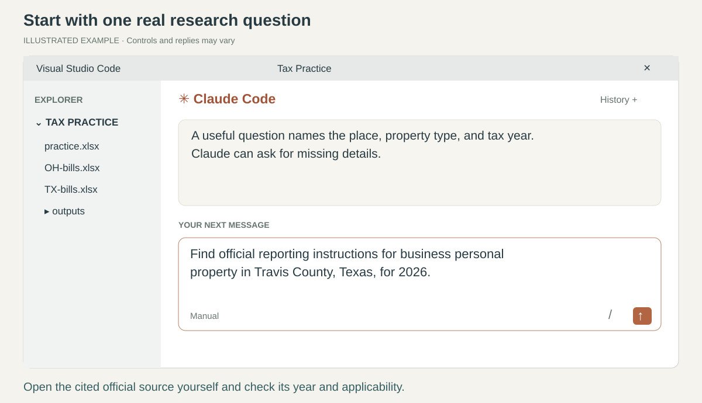
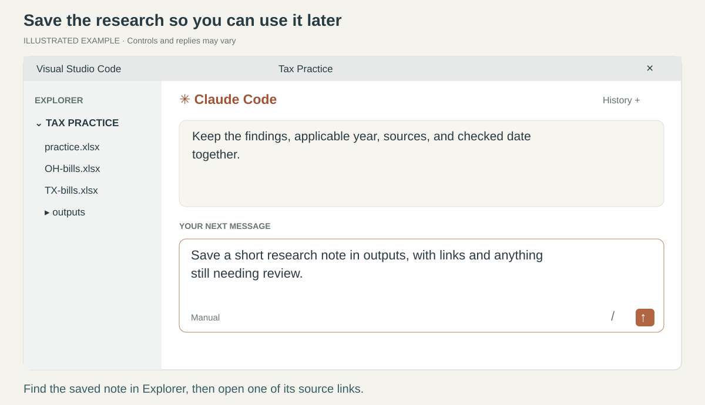
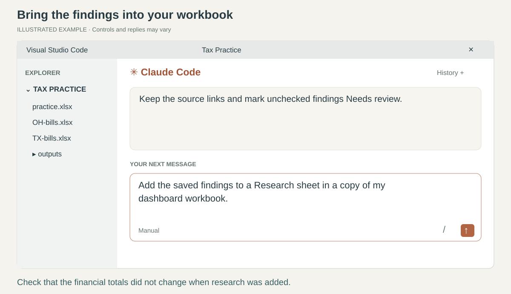
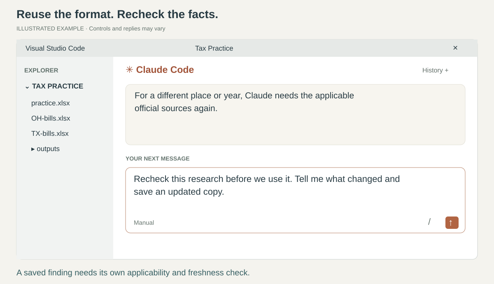

# 4. Research and use the findings

[Home](../README.md) · [Back](03-excel.md) · Page 4 of 5 · [Next: save and reuse](05-repeat.md)

Start with one question. Claude can search, read sources, and save findings when your approved
connection provides those tools. You review the source and decide how the research applies.

*The pictures show illustrative conversations. They do not assert a tax rule or a verified deadline.*

## 1. Ask a research question

In Claude's message box, say:

> Find the official instructions for reporting business personal property in Travis County, Texas, for 2026.

You supplied the place, property type, and year. For a different question, use your own.
If you start with “Research the filing rules,” Claude should ask for the missing details.

Then add:

> Use official sources and show me the links. Tell me what you couldn't verify.

**Check:** open at least one cited link yourself.
Useful starting points for this example are the [Texas Comptroller's forms](https://comptroller.texas.gov/taxes/property-tax/forms/)
and [Travis Central Appraisal District's rendition information](https://traviscad.org/renditions).
Check the actual form or instructions for the requested year and type of property.
A current website is not automatically evidence for a different tax year.

If Claude cannot browse, say, “Explain how I can give you an official source instead.”
You can paste its public URL or place an approved downloaded document in the work folder.
Claude must tell you if it could not open a source or verify that it is current.

## 2. Save the useful research

After discussing the answer, say:

> Save a short research note in outputs. Include the source links, tax year, and anything still needing review.

Claude can write the note for you. Ask it to include the date it checked the sources.
The saved note should make sense when you open it next month without the conversation.

**Check:** find the note in VS Code's Explorer. Click it to read it.
If it is a **.md** file, it is a plain-text document called Markdown.
Press **Ctrl+Shift+V** (Mac: **Cmd+Shift+V**) with that file open to see a formatted preview.

Open a cited source and confirm one finding, including its page or section.
Tell Claude what you verified and what remains unresolved.
Finding a source does not itself approve a tax position.

## 3. Add the research to Excel and the dashboard

Continue:

> Add the saved findings to a Research sheet in a copy of my dashboard workbook. Keep the links and mark unchecked findings Needs review.

Tell Claude which workbook if it asks. It should preserve the financial detail and add research
with its state, jurisdiction, property type, tax year, source links, and review status.

Then say:

> Add a small research section to the dashboard showing what still needs review.

**Check in Excel:** the same findings and links appear. For the practice dashboard, financial
totals remain **$1,000**. The research section must not silently change amounts or create filing dates.
A research finding about Travis County should not automatically apply to every Texas property.

**Try it yourself:** ask Claude to show only the research items you still need to check.

## 4. Reuse it for another state or a later month

For your next question, name the actual state, local jurisdiction, property type, and tax year.
Say, for example:

> Use the same research format for my next question. Ask me what you need, and verify the applicable official sources again.

For a saved finding you want to reuse:

> Recheck this research before we use it. Tell me what changed and save an updated copy.

**Check:** new findings have their own applicable sources and checked dates.
Old conclusions are not copied into a new state or year as if they were established facts.

**Next: [Make the next task easier](05-repeat.md).**
