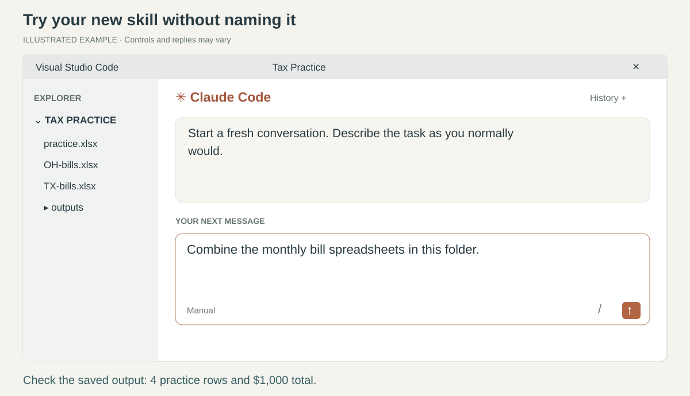
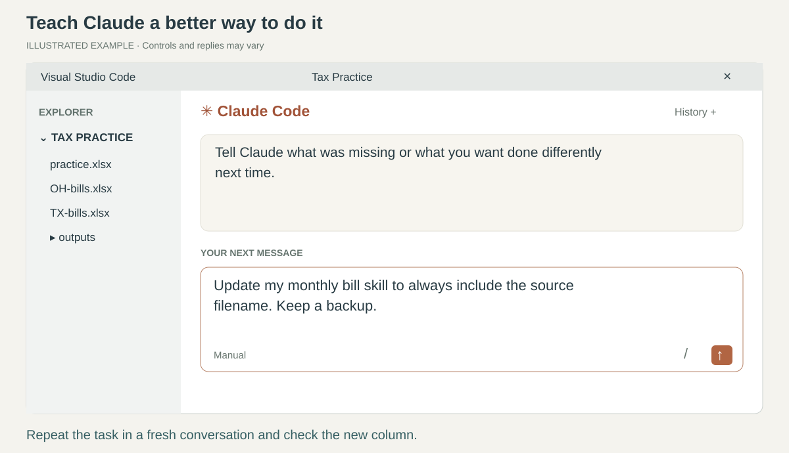
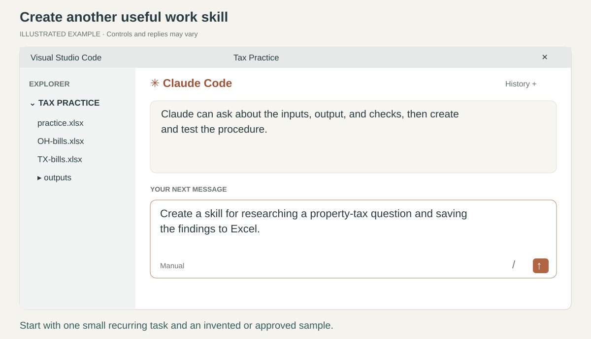
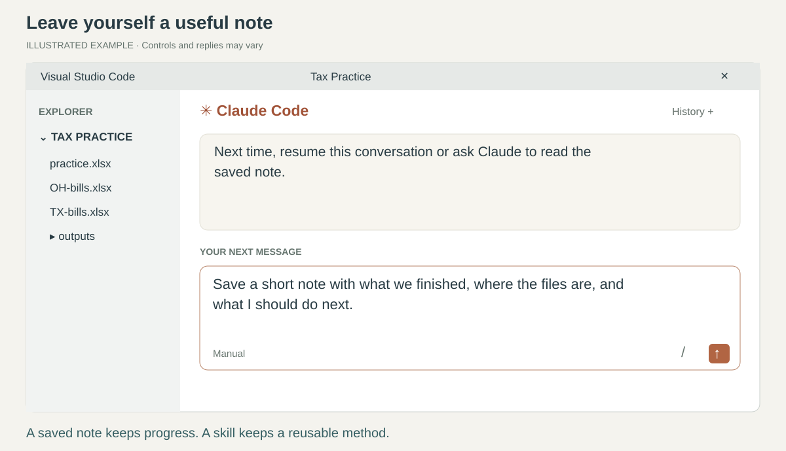

# 5. Make the next task easier

[Home](../README.md) · [Back](04-research.md) · Page 5 of 5

You have now described work, checked a result, and improved it.
A skill lets Claude reuse a procedure that worked. You can ask Claude to create and maintain it.

*The pictures are illustrative conversations. Test your own saved procedure on practice data.*

## 1. Ask Claude to save a successful procedure

Return to the conversation where your spreadsheet consolidation worked. Say:

> Save this process as a skill for this folder. Use it when I ask you to combine monthly bill spreadsheets.

Then add one useful requirement if needed:

> Keep the originals, check the totals, and save a new workbook. Ask if the columns don't mean the same thing.

Claude should create the skill, explain what it will do, and show where it saved it.
You do not need to write the skill file yourself. If it only gives you instructions to copy, say:

> Please create and save the skill for me, then test it on the practice files.

**Check:** it should save a real skill in this project's **.claude/skills** folder, with a **SKILL.md**
instruction file inside its own subfolder. These names explain what you may see in Explorer;
you do not need to type them. A saved conversation or a loose note alone is not an installed skill.

The skill should describe when to use it, the work to perform, where to save results, and how to check them.
A skill guides the tools Claude has; it does not give Claude a missing Excel tool or new permissions.

## 2. Try it in a fresh conversation

Open the Command Palette: **Ctrl+Shift+P** (Mac: **Cmd+Shift+P**).
Choose **Claude Code: Open in New Tab**. In this new conversation, say:

> Combine the monthly bill spreadsheets in this folder.

For this practice, clarify that you mean **OH-bills.xlsx** and **TX-bills.xlsx** if asked.
You should not need to name the skill.
If Claude does not find the new procedure, [reload the window](../HELP.md#reload-the-window)
and ask it to check the installed skills.

**Check:** it follows your procedure, preserves the original files, and creates a new workbook
with **4 rows and $1,000 total**. Ask, “Which saved procedure did you use?”
Its answer is useful, but the actual saved file and checks are the proof.

## 3. Improve or adapt an existing skill

After spotting something you want done differently, say:

> Update my monthly bill skill to always include the source filename. Keep a backup of the old version.

Claude should show what changed, save the update, and test it again.
If the skill came from an installed plugin, ask for a personal copy first:

> Make my own version of the installed spreadsheet review skill. Keep the original. Ask me what I want to change.

Ask Claude to give your version a specific purpose, such as **our monthly bill review**, so it does not
compete with every general spreadsheet request. Plugin updates can replace installed plugin files;
your personal adaptation should be saved separately.

**Check:** repeat step 2 in a fresh conversation and look for the new source-filename column.
If the update made the result worse, say, “Restore the backup and retest.”

To use your skill in other work folders, ask:

> Make this skill available to me in my other work folders. Keep my existing skills.

Claude should save a user-level copy and check for conflicting versions.
Keep employer-specific procedures in approved private storage.

## 4. Add another useful work procedure

Choose one recurring task, describe the result, and let Claude ask for missing details.

| What you want | An ordinary request |
| --- | --- |
| Repeat tax research | “Create a skill for researching a property-tax question, saving official sources, and adding findings to Excel. Ask for the state, jurisdiction, property type, and year.” |
| Check a recurring workbook | “Create a skill for checking our monthly spreadsheet. Ask me which checks matter, then test it on this sample.” |
| Prepare reviewer notes | “Turn our workpaper summary process into a skill. Include completed checks, exceptions, and questions for the reviewer.” |
| Explain formulas | “Help me understand this formula and check it with one example.” |
| Organize today's work | “Read this task list and help me decide what to do first. Ask me which deadlines are confirmed.” |

For a new skill, ask Claude to **run it on a sample**, save the requested output, and show a check.
If it merely writes a description without doing the work, ask it to complete the sample task.
Keep any needed scripts or templates with the skill; Claude can manage those files.

**Check:** you get a useful output and can explain one check yourself.

## Before you stop for the day

Say:

> Save a short note with what we finished, where the files are, and what I should do next.

Next time, open the same folder and use the **Session history** button at the top of Claude's panel
to resume the conversation. Or start a new conversation and ask it to read the saved note.

A **prompt** asks for work now. A **saved note** preserves facts and progress.
A **skill** preserves a reusable method. **Global instructions** preserve your general preferences.

**Try it yourself:** describe a small real task in your own words, answer Claude's questions,
and check the output. That is the everyday workflow.
