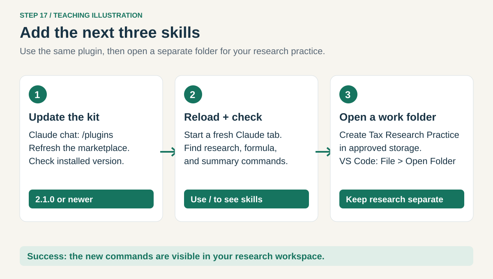
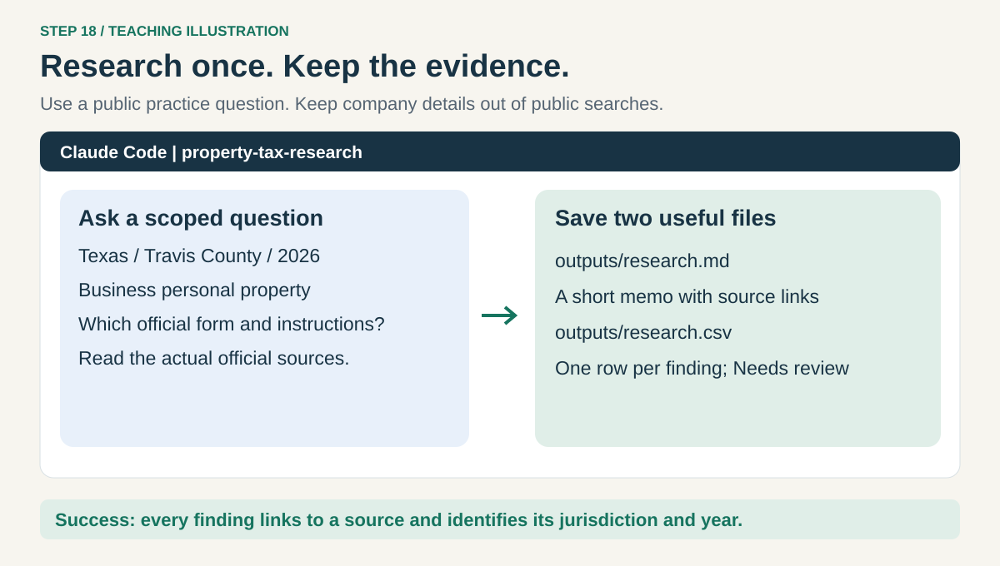
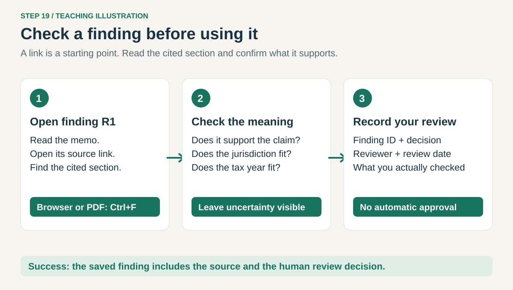
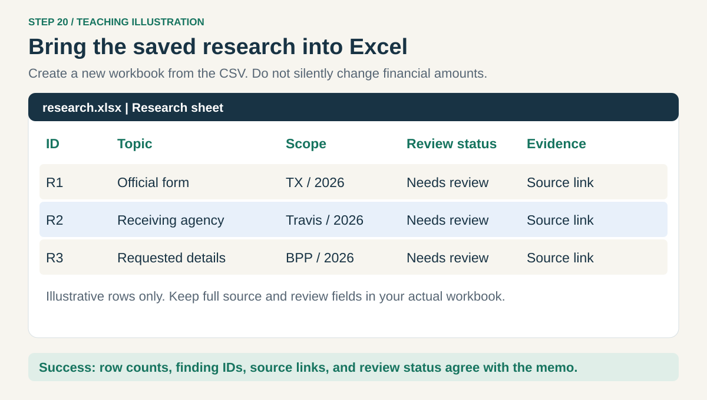
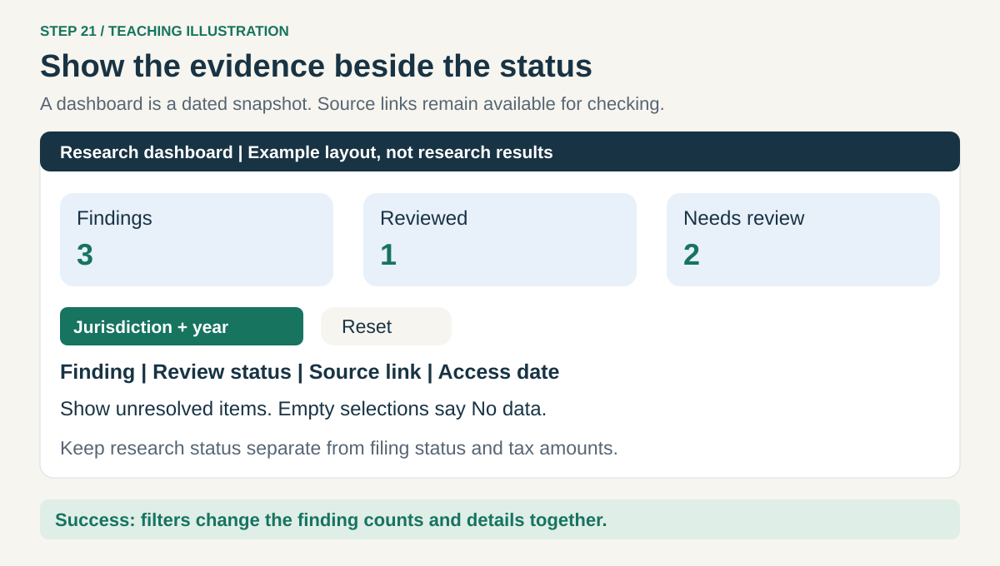

# 5. Research a property-tax question and use the answer

[Home](../README.md) · [Dashboard](04-dashboard.md) → **Research** → [Your own skills](06-your-skills.md)

Do this after the first four lessons. Your goal is one short, sourced answer saved for reuse.
A **source** is the official page or document supporting a finding. A **finding** is one small
answer, labeled R1, R2, and so on so you can trace it later. Research is a draft until reviewed.

## Step 17. Get the new skills and open a research folder



In Claude's message box, open `/plugins`. Under **Marketplaces**, refresh **property-tax-learning**.
Check the installed **property-tax-workbench** package for an update to **2.1.0 or newer** and use
its update control when offered. Refreshing the list alone does not prove the package updated.
If your version has no update control, ask IT for the supported update route. New users can follow
[lesson 2](02-skills.md) to install it. [Official plugin controls](https://code.claude.com/docs/en/vs-code#manage-plugins).

[Reload VS Code and open a fresh Claude tab](../HELP.md#reload-claude-code). Type `/` and check for:

```text
/property-tax-workbench:property-tax-research
/property-tax-workbench:excel-formula-helper
/property-tax-workbench:workpaper-summary
```

In Windows File Explorer, create **Tax Research Practice** in approved storage. In VS Code choose
**File → Open Folder** and select it. Reopen Claude. Keep this separate from the Ohio workbook exercise.

**Check:** the three new commands are listed and the Explorer shows Tax Research Practice.
A research skill supplies a process; your company's tools determine whether web access works.

## Step 18. Ask one question and save the sources



This exercise uses public Texas sources and no company data. A *rendition* is a report of business
property information. Start with the [Texas Comptroller's forms page](https://comptroller.texas.gov/taxes/property-tax/forms/)
and [Travis Central Appraisal District's rendition page](https://traviscad.org/renditions).
Paste into **Claude's message box**:

```text
/property-tax-workbench:property-tax-research
For learning only: find the official business personal property rendition
form and filing instructions for Travis County, Texas, tax year 2026.
Identify the form, receiving agency, and the information the form requests.
Start with https://comptroller.texas.gov/taxes/property-tax/forms/ and
https://traviscad.org/renditions . Open the actual sources, not just snippets.
Verify whether each source applies to 2026; mark anything uncertain.
Do not determine a real filing obligation or submit anything.
Save a short memo to outputs/research.md and a findings table to
outputs/research.csv. Include finding IDs, jurisdiction, year, property type,
source URLs and sections, source date, access date, and review status.
Start every finding as Needs review. Explain one finding I can check.
If web access is unavailable, say so and ask for a saved official source.
```

**If web access is blocked:** open the official page yourself in your browser. Save its PDF using
the download button into a `sources` folder inside Tax Research Practice. Return to Claude and say:

```text
Use sources/[filename.pdf] and this original URL: [paste the official URL].
Record that this is a supplied copy, when I downloaded it, and that live
verification was unavailable. Keep any unproved tax-year applicability unknown.
```

Replace the brackets. For a page without a PDF, use **Ctrl+P → Save as PDF** if your browser offers it.
Check that the saved copy contains the relevant text. Do not upload confidential details to public search.

**Check:** expand **outputs** in VS Code Explorer and open `research.md`. Every factual finding has a
source you can open. No access or no evidence means an unresolved item, not a made-up answer.

## Step 19. Review before reusing a finding



Click a source link in the memo. In the browser or PDF, press **Ctrl+F** and search a distinctive
phrase from the cited section. Compare the meaning, jurisdiction, and year with Claude's finding.
A publication date is not necessarily its effective tax year. Check unclear rules with the responsible reviewer.

After you or your reviewer have actually checked it, paste:

```text
For finding [ID], record this human review decision: [Reviewed / Needs review],
reviewer [name or approved initials], date [YYYY-MM-DD], and note [what was
checked or remains unresolved]. Update the memo and CSV consistently.
Do not mark other findings Reviewed or change the original source text.
```

**Check:** the finding retains its source and your review note. “Reviewed” means the described
check occurred; it does not mean a filing was approved. Dates and rules need rechecking when reused.

## Step 20. Put the saved research into Excel



A CSV is a simple table file. Let Claude make an Excel workbook from it so dates, IDs, and links
stay intentional. Paste into Claude:

```text
Use the installed xlsx skill to create outputs/research.xlsx from
outputs/research.csv. Keep the CSV and memo unchanged. Make a Research sheet
with one row per finding, readable widths, filters, clickable source links,
and all jurisdiction, tax-year, source, and review fields preserved.
Keep IDs as text and unknown values blank with a note. Reopen the new file
and compare its row count and findings with the CSV. Report unverified checks.
```

In Windows File Explorer, double-click **outputs → research.xlsx**. Check one finding, its source
link, tax year, and review status against the memo. If tools are missing, use the [dependency help](../HELP.md#plugins-or-skills-are-missing).

**For an existing work workbook:** ask Claude to add a **Research** sheet to a **new copy**, after
checking its features. Give the precise workbook path. Do not match rules to properties using
state alone; jurisdiction, year, property type, and the actual rule conditions must also fit.

For that existing-workbook route, replace the brackets and paste:

```text
Inspect [workbook path] for features that must be preserved. If your tools
can preserve them, create a new copy at [new output path] and add a Research
sheet from outputs/research.csv. Keep the original unchanged. Preserve all
source/review fields and compare existing sheet counts, formulas, and totals.
If preservation cannot be verified, keep research in its separate workbook.
```

**Check:** the Excel row count matches the findings table. Adding research does not change
book balances, tax calculations, or deadlines automatically.

## Step 21. Show research in a dashboard



Paste into Claude:

```text
/property-tax-workbench:financial-dashboard
Create outputs/research-dashboard.html from outputs/research.xlsx as one
self-contained local HTML file. Show findings by topic, Reviewed versus
Needs review counts, jurisdiction/year filters, source links, and access dates.
Include unresolved items and a reset button. No data must say No data.
Keep research status separate from tax amounts. Do not create filing deadlines
or calculate liability from unreviewed findings. Test counts, filters, and links.
Show the file's generation date and explain that it is a snapshot.
```

Double-click **outputs → research-dashboard.html** in Windows File Explorer. Filter a jurisdiction
and compare its finding count with Excel. Open one source link. The report itself is local;
following a source link opens the external official website and normally requires internet access.

For an existing dashboard, request a **new copy with a separate Research section**. Keep its
financial totals unchanged and check them again. Do not attach this Texas research to the Ohio
practice properties or treat a research status as a filing status.

For an existing local HTML dashboard, replace the brackets and paste:

```text
Add a separate Research section from outputs/research.xlsx to a new copy of
[dashboard path], saving it as [new output path]. Preserve citations and review
status. Keep the existing accounting logic and totals unchanged. Compare those
totals before and after, and test both the old and new controls. Do not publish.
```

**Check:** source links and review status remain visible. To reuse the work next month, ask Claude
to read the saved memo, recheck relevant sources, and save a dated revision before updating Excel
or the dashboard. Saved files do not refresh themselves.

**Next: [6. Create or modify a skill](06-your-skills.md).**
