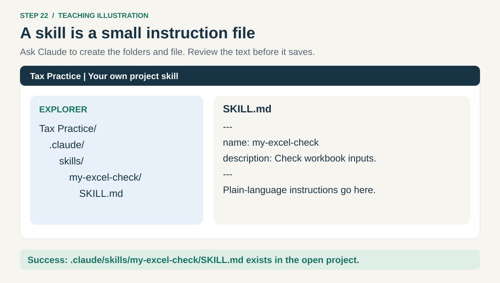
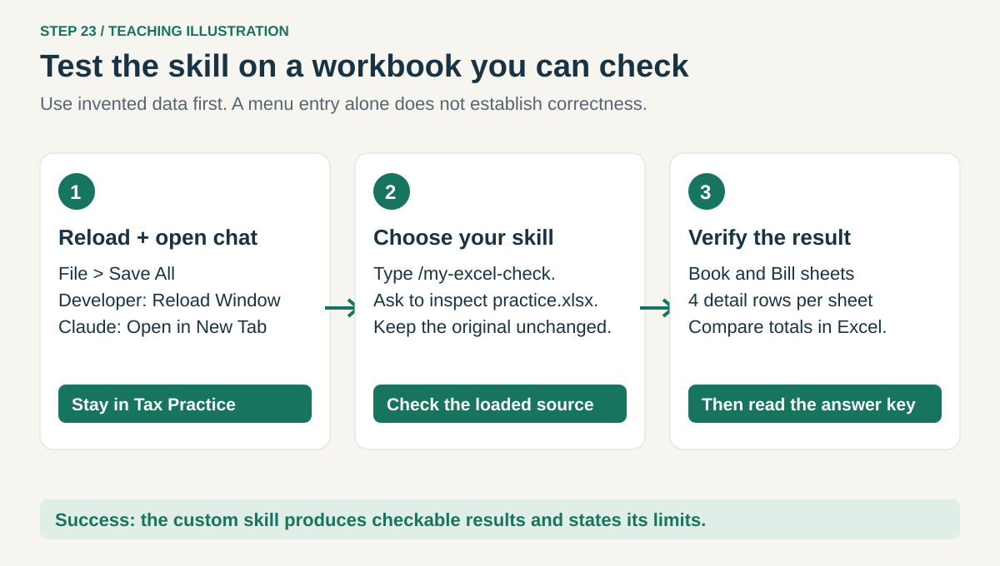
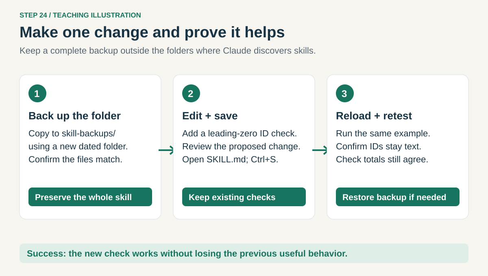
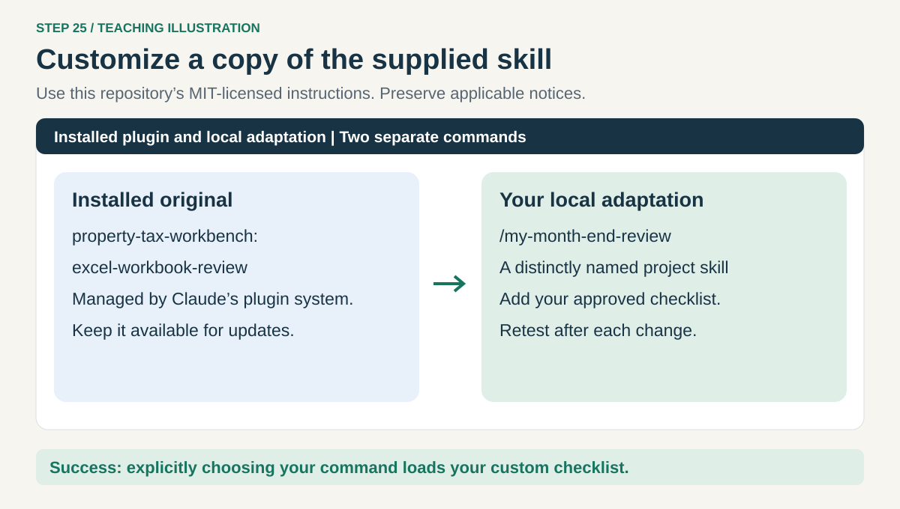
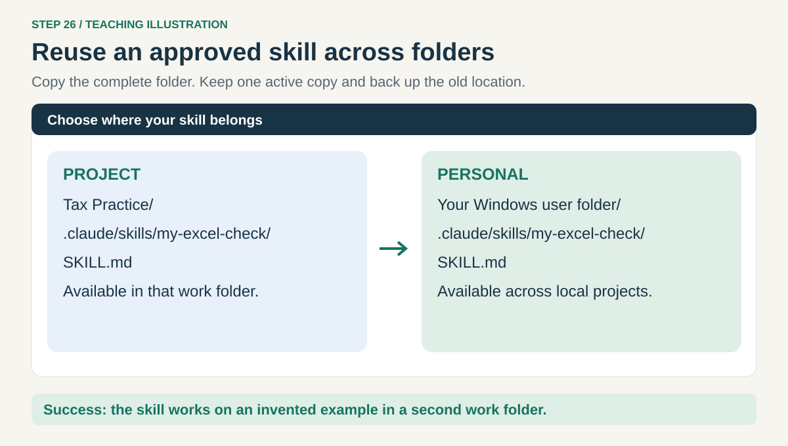

# 6. Create or modify your own skill

[Home](../README.md) · [Research](05-research.md) → **Your own skills** → [Everyday shortcuts](07-productivity.md)

A skill is a small instruction file for a task you repeat. Start after a prompt has worked well.
Keep changing facts, real account details, and this year's tax rules in your work files, not baked into a skill.

## Step 22. Ask Claude to create one small skill



Open **Tax Practice** in VS Code with **File → Open Folder**. In Claude's message box, paste:

```text
Create a beginner-friendly project skill named my-excel-check at
.claude/skills/my-excel-check/SKILL.md in this open folder.
Its job: inspect a supplied workbook without changing it, identify the detail
rows and business key, check duplicate keys and missing amounts, and report
source counts/totals plus one manual Excel check. Preserve text IDs.
Ask for material missing details; do not guess the matching key or tax rules.
Use only available approved tools and report unsupported checks.
Keep the skill short, with name and description between --- lines.
Do not add scripts, install tools, or change my global instructions.
Show the full path and content for review before saving. If it exists, stop
and show the existing file instead of replacing it.
```

Read the proposed file, then approve saving it if correct. A **project skill** works in this work
folder. [Claude's skill locations](https://code.claude.com/docs/en/skills#where-skills-live) explain the distinction.
The small header should look like this:

```yaml
---
name: my-excel-check
description: Check workbook detail rows, duplicate keys, missing amounts, and source totals before reconciliation.
---
```

The plain-language instructions go below that header. You do not need to memorize YAML; keep
those `---` lines and the two labels intact.

**Check:** expand **.claude → skills → my-excel-check** in VS Code Explorer. Click **SKILL.md**.
The file must be inside that skill folder and must not end in `.txt`.

## Step 23. Run it on the practice workbook



Choose **File → Save All**, then [reload and open a fresh Claude tab](../HELP.md#reload-claude-code).
Type `/my-excel-check` and select it. Paste the rest of this request:

```text
/my-excel-check
Inspect practice.xlsx. Do not change it or read ANSWER-KEY.md.
Report duplicate keys, missing amounts, source counts/totals, and one
manual check. Say which checks could not be performed.
```

**Check:** the result identifies the two sheets, four detail rows on each, no duplicate keys,
and no missing amounts within those source detail rows. Verify the totals
in Excel and then consult the [answer key](../practice/ANSWER-KEY.md). The name appearing in the menu
proves discovery; a correct practice result is the useful test.

**Skill missing?** Confirm the open folder and exact path. If a same-name personal or managed skill
exists, ask Claude to identify the loaded source. Use a distinctive name; do not remove managed skills.

## Step 24. Improve it, then test the change



In Claude's message box, paste:

```text
Read .claude/skills/my-excel-check/SKILL.md. Back up the complete folder to a
new dated folder under skill-backups/ in this project, outside .claude/skills.
Confirm the backup matches. Propose one change: add an explicit check for
leading-zero IDs. Keep the existing protections and scope. Show the change
before saving it. Do not edit any other skill or plugin.
```

Approve the change after reading it. In Explorer, open **SKILL.md** and confirm the new sentence.
To make a small edit yourself, click the sentence in that file, type your change, and press **Ctrl+S**.
Reload, start a fresh Claude tab, and repeat step 23. Ask it to explain how `001101` is stored.

**Check:** it now reports the text/leading-zero check and still reports counts and totals correctly.
If the change makes results worse, ask Claude to restore only this skill from the verified backup,
then reload and retest. Do not place backup copies inside any active `.claude/skills` directory.

## Step 25. Adapt a supplied skill without losing updates



Plugin files are managed by Claude; updates can replace them. Make a named local adaptation of
one of **this repository's MIT-licensed skills** instead. For example, paste:

```text
Read the installed property-tax-workbench:excel-workbook-review skill.
Show the source path. Create a project adaptation named my-month-end-review
at .claude/skills/my-month-end-review/SKILL.md. Keep its original safety and
reconciliation checks. Add a short closing checklist: source dates, unresolved
items, reviewer questions, and output locations. Retain applicable license
notices. Show the proposed file before saving; stop if the target exists.
Leave the installed plugin unchanged. Do not copy Anthropic's Office skills.
```

Approve the file after review, reload, and explicitly run **`/my-month-end-review`** on the practice
workbook. Use the full plugin command when you want the original. Keep the adaptation's description
specific so normal requests are less likely to select the wrong process.

**Check:** both commands work and your custom checklist appears only when requested by your adaptation.
Local adaptations do not inherit later plugin fixes automatically; compare them when the plugin updates.

**Make a property-tax version:** use step 22 with the name `my-tax-source-check`. Ask it to require
state, locality, property type, and tax year; read official sources; save citations and review status;
and keep unsupported claims unresolved. Test with the public question in lesson 5.

## Step 26. Reuse a skill in another work folder



Keep the first experiment project-only. When your employer permits a reusable **personal skill**,
open Windows File Explorer, enter `%USERPROFILE%` in the address bar, and press **Enter**.
Open **.claude → skills**, creating `skills` if needed. Copy the **whole skill folder**, including
SKILL.md and any referenced files, into it. Compare an existing same-name folder before replacing it.

The destination for this example is:

```text
C:\Users\YourName\.claude\skills\my-excel-check\SKILL.md
```

Verify the copy. Move the old project copy to its dated **skill-backups** folder so you maintain
one active copy. Keep unrelated skills intact. Reload and test in a different approved work folder.
Personal means all your local projects, not publication or sharing with other people.

**Adding a skill from elsewhere?** Prefer an employer-reviewed plugin installed through lesson 2.
Check the source, license, supporting files, and required tools. Do not paste an unknown installer
into a terminal. A single SKILL.md may be insufficient for a skill that needs scripts or references.

**Check:** the menu finds your skill in the second folder, and it passes a small invented example.
If policy blocks local skills, ask IT to package the approved instructions; do not bypass the restriction.

**Next: [7. Use skills for everyday productivity](07-productivity.md).**
