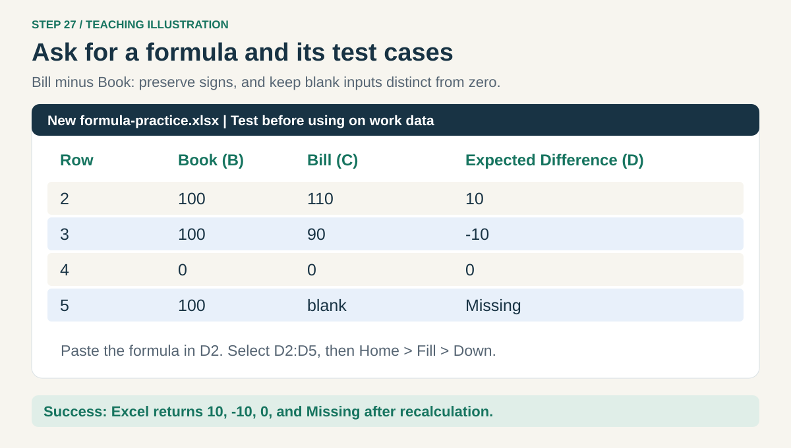
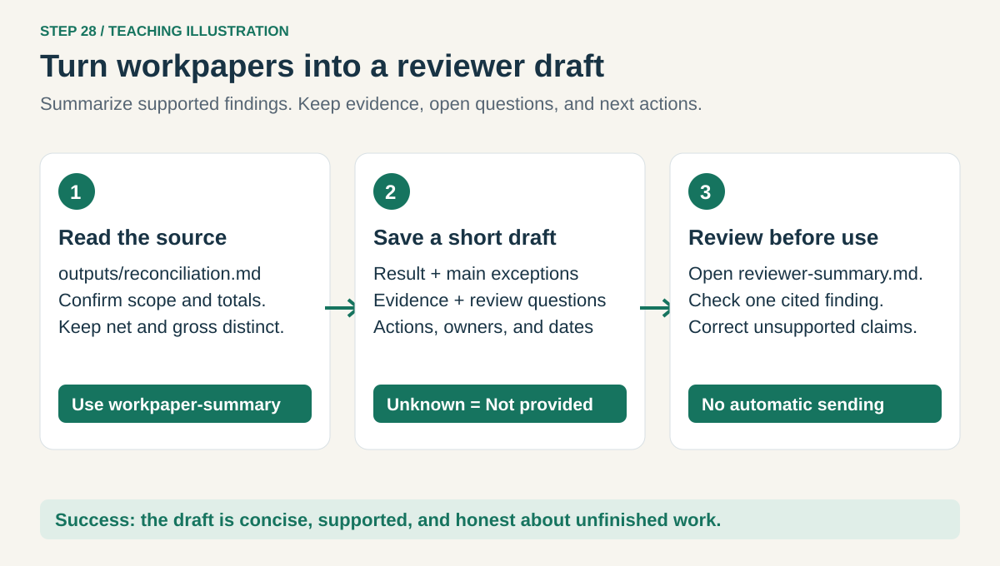
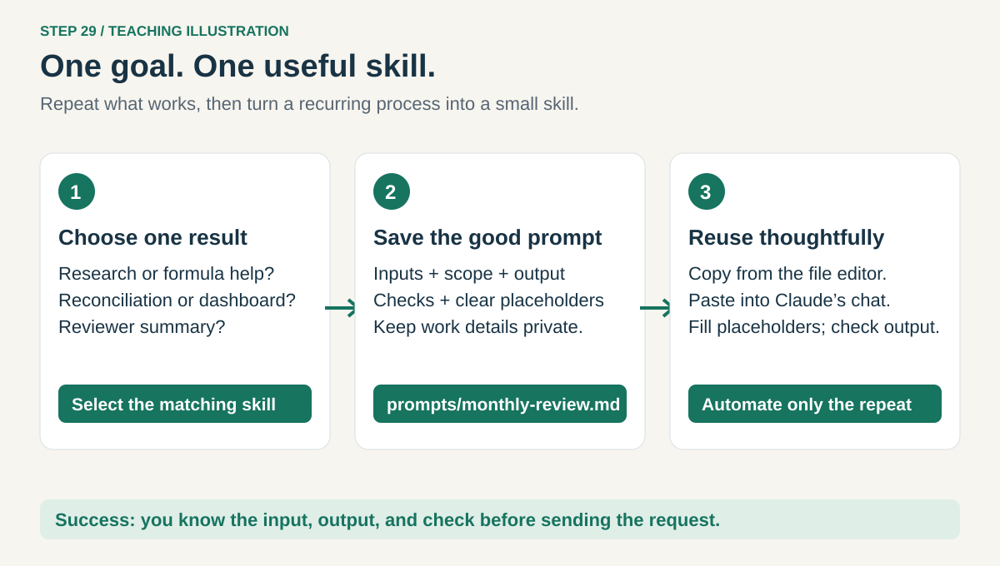

# 7. Use skills for everyday productivity

[Home](../README.md) · [Your own skills](06-your-skills.md) → **Everyday shortcuts**

Choose one useful result. These skills arrive with the same property-tax-workbench installation;
there is no extra plugin to find. Use the [update steps](05-research.md#step-17-get-the-new-skills-and-open-a-research-folder)
if the commands are missing.

## Step 27. Get help with an Excel formula



Open **Tax Practice** in VS Code and paste into Claude:

```text
/property-tax-workbench:excel-formula-helper
Teach me a Bill minus Book formula. In a NEW workbook, Book amount will be
column B, Bill amount column C, and Difference column D, starting in row 2.
Give a formula that shows Missing if either amount is blank, otherwise C-B.
Treat numeric zero as a real amount. Explain each part in plain English.
Use the xlsx skill if available to create outputs/formula-practice.xlsx with
invented tests: 100/110, 100/90, 0/0, and 100/blank. Include expected results
and tell me exactly where to paste the formula in Excel. Preserve practice.xlsx.
Do not claim the formula was recalculated unless a calculation engine ran.
```

Open the new file in Excel. Click **D2**, paste the supplied formula, and press **Enter**.
Select **D2:D5**, then use **Home → Fill → Down** to copy the formula down. Compare with the
expected results: **10, -10, 0, Missing**. Do not replace the blank test with zero.

**Check:** all four cases agree after Excel recalculates. If the formula is rejected, tell Claude
your Excel version, language, and exact error; separators or function support may differ.
If file generation is unavailable, enter these four invented rows into a blank Excel workbook
and follow the same formula check.

For real work, this skill can explain a formula, build a lookup, or flag missing inputs. Provide
column names and a small approved example; ask it to check duplicate lookup keys before matching.

## Step 28. Turn workpapers into a useful draft summary



After the Excel lesson, open **Tax Practice** and paste:

```text
/property-tax-workbench:workpaper-summary
Read outputs/reconciliation.md. Save outputs/reviewer-summary.md with a
short result, the main exceptions, source totals, and questions for review.
Include an action table with item, evidence, next action, owner, and due date.
Use Not provided for owners or dates the source does not supply. Keep the
$0 matched net, $20 matched gross, and +$100 full difference distinct after
checking them against the source. Label this invented practice work.
Do not send messages, schedule tasks, or mark anything approved.
```

In VS Code Explorer, open **outputs → reviewer-summary.md**. Press **Ctrl+Shift+V** to preview it.
Compare a claim and its reference with the reconciliation. Ask Claude to correct any unsupported
statement before using the summary.

**Check:** the summary separates completed work from open questions. It does not invent a cause,
commitment, deadline, or approval. For a real task, use this to prepare a reviewer note or draft
email, then follow your normal review and sending process.

## Step 29. Choose the right skill and save a repeatable prompt



Use this small menu instead of asking Claude to do everything at once:

| I need to... | Select after typing `/` |
| --- | --- |
| Understand a file or reconcile records | `property-tax-workbench:excel-workbook-review` |
| Find and save official tax sources | `property-tax-workbench:property-tax-research` |
| Explain or test an Excel formula | `property-tax-workbench:excel-formula-helper` |
| Make a checked dashboard | `property-tax-workbench:financial-dashboard` |
| Prepare a reviewer summary or action list | `property-tax-workbench:workpaper-summary` |

After a prompt works, ask:

```text
Save a reusable version of my successful request to prompts/[task-name].md.
Replace work-specific details with clear placeholders for inputs, scope,
output, and checks. Do not include confidential facts or hard-code tax rules.
Show it before saving and do not replace an existing prompt without asking.
```

Replace `[task-name]` with a short name, such as `monthly-review`. Next time, click that prompt file
in the **editor**, press **Ctrl+A → Ctrl+C**, click Claude's **message box**, and press **Ctrl+V**.
Fill the placeholders before sending. If the same procedure keeps repeating, turn it into a skill
using lesson 6. Keep personalized work prompts in approved storage.

**Check:** you can state the input, the desired output, and how you will check it before pressing Enter.

[Back to the course](../README.md) · [Reload or restart help](../HELP.md)
